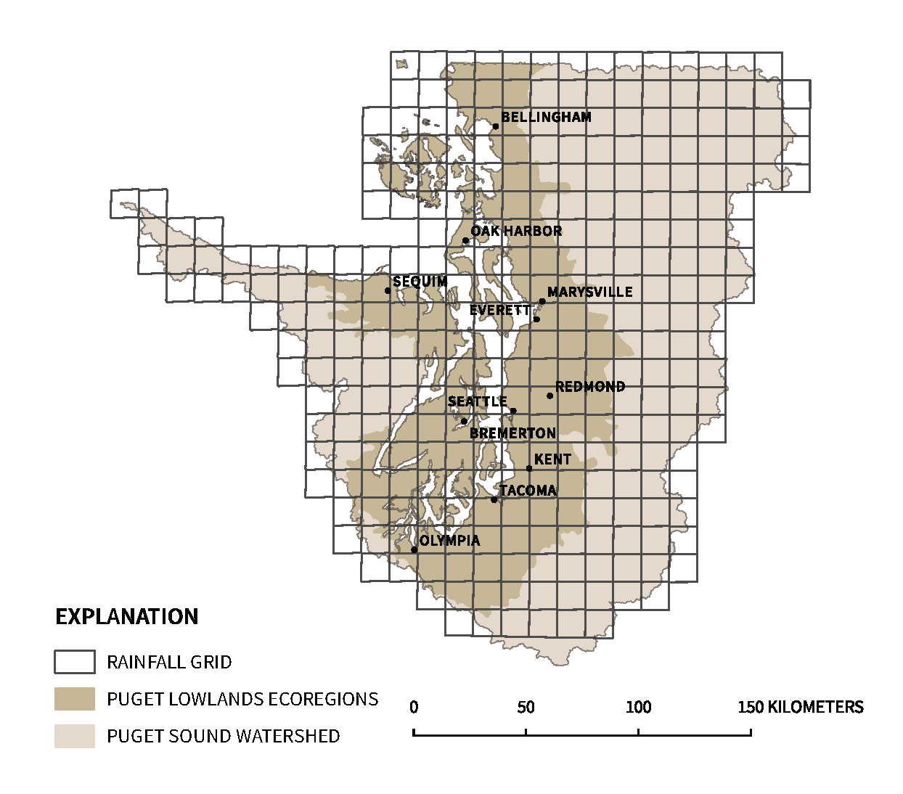

--- 
title: "Stormwater Heatmap Technical Reference"
subtitle: "Review Draft. Not for release."
author: 
  - Christian Nilsen, Geosyntec Consultants, Inc.
  - Emily Howe, The Nature Conservancy
  - Jamie Robertson, The Nature Conservancy
date: "Last updated: `r Sys.Date()`"
knit: bookdown::render_book
site: bookdown::bookdown_site
documentclass: report
bibliography: references.bib
biblio-style: apalike
link-citations: yes
github-repo: "stormwaterheatmap"
url: 'https\://stormwaterheatmap.github.io/'
---

# Abstract {-} 

The Stormwater Heatmap project springs forth from The Nature Conservancy’s (TNC) Cities program, which strives to bring TNC’s core mission − preserving and protecting the land and waters upon which all life depends − to urban areas.  As the leading contributor of toxic pollutants to Puget Sound’s streams, rivers, and marine waters, urban stormwater runoff is a key ecological problem generated by Washington’s urban landscapes.  Urban stormwater runoff has harmed virtually all urban and urbanizing streams and rivers, and delivered massive quantities of toxic contaminants to Puget Sound. As a result, the abundance and survival of aquatic species has declined. A recurrent question asked of stormwater managers, eco-toxicologists and ecologists alike, is how much stormwater intervention is needed, and where would you place it for efficient and effective treatment?  

This “how much and where” question serves as the foundation of the stormwater heatmap project. The project quantitatively visualizes a pollution loading threat-map for the Puget Sound watershed.  The stormwater heatmap uses land use, landcover, stormwater monitoring data, precipitation data, and hydrological modeling to predictively map stormwater pollution loading across the Puget Sound landscape, and quantifies the pollution load on a 1-m^2^  spatial resolution.  This scale allows managers and planners to aggregate data at multiple spatial scales, and allows us to “see” hotspots of pollution loading for a variety of monitored stormwater contaminants.  With the pollution visualization layer in place, we can now begin to overlay social-ecological questions in order to develop a stormwater intervention action-map.


<!--chapter:end:index.Rmd-->

```{r include = FALSE}
if(!knitr:::is_html_output())
{
  options("width"=56)
  knitr::opts_chunk$set(tidy.opts=list(width.cutoff=56, indent = 2), tidy = TRUE)
  knitr::opts_chunk$set(fig.pos = 'H')
}
```

# Introduction
## What is Stormwater?

One of the primary terrestrial pressures on the Salish Sea estuarine and marine environment is urban stormwater runoff. When rainfall runs across hard, impervious surfaces, rather than soaking into the soil, it picks up and delivers toxic contaminants directly to nearby streams, rivers, and eventually the Salish Sea. In fact, for most toxic substances, surface runoff is the largest contributing source of loading to Puget Sound [@WashingtonStateDepartmentofEcology2011]. 

Unfortunately, the Salish Sea’s relationship with stormwater effluent is no outlier; stormwater is the fastest growing cause of surface water impairment in the United States as urbanization transitions forested and other natural landscapes to hard, impervious surfaces [@USEPA2019]. Given that the Salish Sea is expected to house another 5 million people by 2040, stormwater interventions will be necessary in order to break the relationship between urbanization and stormwater-caused ecological degradation. 

Fortunately, researchers have uncovered a variety of successful techniques to reduce stormwater impairment of surface and receiving waters, including street sweeping, pervious pavement, and green stormwater infrastructure wherein stormwater is filtered by soil and plant mixtures on its way between the streets and the sea. These interventions are costly (~\$65-132 billion is needed to restore Puget Sound to hydraulically function like a forest), but the costs of stormwater pollution are high as well: the sickening and deaths of Salish Sea organisms. Annual losses due to one contaminant (polycyclic aromatic hydrocarbon exposure) alone are estimated to be between \$4.4 to $12.1 billion [@County2014; @WashingtonStateDepartmentofEcologyandWashingtonDepartmentofHealth2012].

## Urban stormwater runoff is a two-fold problem, impacting the quantity of water pulsing off the land, as well as the quality of that water. 

As a result of stormwater’s twin problems, urban watersheds and marine receiving waters suffer from “urban syndrome”- a condition that results in low abundance and survival of sensitive aquatic and coastal species [@Walsh2005]. Virtually all urban streams and rivers in Puget sound have been harmed by stormwater pollution xxx [@booth2004reviving].

### Water Quantity

Watersheds with as little as 5-10% impervious surface area- such as rooftops, roads, and paved parking areas- exhibit aquatic habitat degradation as a result of increased surface runoff  (Walsh et al., 2005). This changes the timing, magnitude, and frequency of high flow events, making urban streams “flashier” than those with natural surrounding landcover conditions. These hydrological changes cause combined sewer overflow events, flooding, erosion, and scouring of stream and riverbeds. Flashy hydrology disrupts habitat structure and alters the ecology of freshwater ecosystems themselves, but also disrupts larger ecosystem processes in marine environments such as nutrient flux, organic matter processing, and ecosystem metabolism [@Palmer2019] While coastal food webs rely on rivers to deliver organisms, nutrients, and detritus from the land to the sea, these fluxes increasingly result in negative impacts, such as eutrophication, hypoxia, and harmful algal blooms. 

### Water Quality 

In addition to altering hydrological flow regimes in watersheds contributing to the Salish Sea, urban stormwater also delivers a suite of contaminants that severely impact the water quality of streams, rivers, estuaries, and the Salish Sea itself. Urban runoff contains complex and unpredictable mixtures of chemicals, including persistent organic pollutants (i.e. PCPs), heavy metals (i.e. copper, zinc), hydrocarbons (i.e. motor oil, tailpipe emissions, rubber tire particles), nutrients (nitrogen, phosphorous), pesticides, and pharmaceuticals . Toxic pollutants entering the Salish Sea may be metabolized in plant and animal tissues, bioaccumulated in tissues, incorporated into sediments, volatized, degraded, or conserved in marine waters. 

## Toxic Stormwater Impacts

Researchers have documented toxic effects of stormwater exposure for a diverse range of aquatic and marine species, ranging from primary producers to high trophic-level predators. Some effects are sublethal, reducing species fitness and long-term survival. For example, heavy metal accumulation is common among marine macroalgae and eelgrass (Zostera marina), reducing photosynthetic function [@Jarvis2015; @Lyngby1984]. Other sublethal impacts of stormwater on marine organisms include the reduction of byssus strength in marine mussels [@Gaw2014], reduced olfactory function in juvenile salmonids [@Baldwin2011], reduced growth and lipid storage in juvenile Chinook [@Meador2006], reduced pathogen resistance in juvenile salmon [@Arkoosh2001],  cardiotoxicity in juvenile fish [@Incardona2011], decreased reproductive function and immune response in benthic fishes [@Rice2000], seals [@Anan2002], and Southern Resident Killer Whales [@Kayhanian2012; @Ross2000; @WDFW2011].

Some effects are acutely lethal, as is the case for adult coho salmon, where pre-spawn mortality rates in urban streams can be as high as 90% [@Scholz2011]. These fish end their years-long journey to the ocean and back with their bellies still full of unfertilized eggs, missing their single chance to spawn the next generation. For coho, it appears that pre-spawn mortality is linked to the transportation network, where contaminants, like tire wear leachates, are generated [@Feist2017]. Thus, development expansion and increasing use intensity of the built environment is significantly impacting the long-term viability of local Coho populations, with far-reaching ramifications for both freshwater and marine food webs alike. And while it is tempting to focus on lethal impacts to iconic species such as coho, road runoff is similarly lethal to lower trophic level organisms, such as mayfly larvae, sea urchins, and amphipods, which all play important roles in upholding marine, freshwater, and terrestrial food webs [@Anderson2007; @Kayhanian2012; @McIntyre2015 ]. 

## Moving forward- identifying where stormwater pollution is generated on the landscape

A much repeated phrase from stormwater managers is “how much and where” do we need to implement stormwater BMPs (Best Management Practices)?  This is a difficult question to answer until we identify our ecological and social goals for stormwater management. The amount and spatial configuration of stormwater interception techniques will look very different depending on whether the goal is to meet permit regulations, recover coho salmon, or recover Southern Resident Killer Whales because biological organisms are susceptible to stormwater contaminants for different reasons, in different locations, at different scales, and at different points in time according to their life history traits [@Levin] Answering the “how much and where” question will therefore require integrating ecological data with stormwater monitoring and pollution loading data. 

However, a promising starting place to answer the “how much and where” question is to build a predictive map quantifying levels of stormwater pollution loading across the landscape. This type of ‘threat’ heatmap can be coupled with ecological data to produce action maps for stormwater intervention. 

To build the predictive stormwater pollution heatmap, we focused on three major steps: 

**1. Landcover Refinement:** we generated a high resolution landcover dataset enabling landcover mapping at the 1-m^2^ resolution. This is a critical level of resolution for urban runoff modeling because impervious surfaces so strongly drive hydrologic response, and therefore pollution loading. Thus, accurate mapping of impervious surfaces was needed to accurately calculate surface runoff. 

**2.	Hydrology:**  we conducted continuous hydrology simulations for the 32 different hydrologic response units (HRU = combination of landcover, soils, & slope) found within the Puget Sound domain. Using regional precipitation datasets provided by the Climate Impacts Group, we modeled both current and future hydrology in order to assess how climate change will impact stormwater pollution loading across the landscape, generating more than 311 billion rows of data. This dataset alone provides an efficient way to quickly model rainfall-runoff relationships across Puget Sound using the Western Washington Hydrology Model (WWHM).

**3. Pollution Statistics:** We used Bayesian statistical modeling to link stormwater monitoring data to land use and land cover characteristics to predict pollution concentrations across the landscape. These concentration predictions were then combined with hydrology output to generate the pollution load across the Puget Sound landscape at a 1-m^2^  spatial resolution.

The resulting interactive tool enables users to visualize and aggregate stormwater pollution loading data at several spatial resolutions for local, watershed, and regional-scale planning. The project reveals that areas with high percent cover of impervious surfaces, such as hard cityscapes, as well as industrial and commercial zones, tend to produce higher pollutant loads than high-density residential, low-density residential, and rural areas. Transportation networks- roads and highways- generate very high levels of stormwater contaminants, especially those with higher traffic intensity. These high intensity roads can cut through lower-density areas, lighting up as pollution hotspots. Traffic behavior (i.e. congestion points) also plays a role, indicating that a combination of a static landscape structure and dynamic anthropogenic behavior layered atop that structure can combine to create stormwater pollution hotspots throughout the landscape. 

Using the stormwater heatmap as a foundation, we can begin to integrate the ecological layers to understand exactly where on the landscape stormwater interventions will be most efficient and effective at breaking the link between urbanization and aquatic degradation. Examples of spatialized biotic response data generated by robust local monitoring programs include NOAA’s MusselWatch, King County’s Benthic-Index of Biotic Integrity (B-IBI), and NOAA’s coho pre-spawn mortality monitoring. WDFW’s Salmonscape data represents another source of ecological information, showing the timing and spatial habitat use of different species of salmonids. With respect to human well-being Front and Centered’s Environmental Health Disparities Map offers data-driven insights on human health in the region. 

## Building an interactive tool to service stormwater manager needs: 

The mapping tool is especially timely because the Washington Department of Ecology recently issued a new stormwater permit which increased the number of jurisdictions required to develop and implement stormwater management plans. Historically, just 4 stormwater permittees were required to submit detailed stormwater management plans and models. Now, 85 jurisdictions must develop stormwater management plans and be able to scientifically defend their prioritization and decision-making process. 

In order to help move more jurisdictions towards this goal/requirement, The Nature Conservancy embarked on a Design Thinking project to better understand what tools those smaller Phase II cities and counties would need in order to meet permit requirements. The Design Thinking approach centers on a structured interview process that is human-centered. Through interviewing stormwater planners, engineers, and leaders throughout the Puget Sound region, this process identified “pinch” and “release” points that currently prevent or promote effective stormwater management. The Design Thinking project emphasized that a tool supporting stormwater management in the region requires the following elements: 

- **Compelling Visuals**: tools should help stormwater managers tell a story to different audiences  

- **Multiple Scales**: stormwater planning takes place at the parcel, neighborhood, watershed and regional scale. Data need to be flexibly aggregated at all scales. 

- **Make it Mine-able**: serve as a data platform and resource for use with other tools. Land cover, soils, hydrology, and climate change impacts data would help meet multiple modeling needs. 

- **Grounded in Science**: data and calculations should be apparent and meet current best practices  

For many of the smaller jurisdictions, financial and personnel constraints are significant barriers to effective stormwater management and innovation. Most projects are opportunistic, and many stormwater management departments have only one employee. 

This stormwater management tool is targeted for stormwater managers in order to 1) get the best available science and tools into the hands of decision-makers, 2) lower the costs for effective decision making and planning, and 3) improve Puget Sound water quality and recover ecological health. 

Thus, in addition to the stormwater pollution loading data layer, the online mapping tool also includes data extraction capabilities and report modules that service requirements outlined by the Department of Ecology’s stormwater permit. The modules can be flexibly applied at multiple scales, and include:  
 
- Land Use/Land Cover   
    - Land cover classification (% cover)   
    - Land use    
    - Imperviousness    
- Hydrology  
    - Hydrologic response units    
    - Mean annual runoff    
    - Flow-control metrics    
    - Climate change impacts    
- Pollutant loading    
    - 25th, 50th, 75th concentration quantiles     
    - 25th, 50th, 75th annual loading quantiles     
- Other   
    - Age of development    
    - Estimated population    
    

## Open data helps us bound forward  
Early adopters are currently testing the capabilities of the data, analyses, and approaches generated by the Stormwater heatmap project. King County is using the hydrology modeling output to prioritize and resize culverts for fish passage. Our Green/Duwamish is using the tool for stormwater management action planning, the City of Tacoma is using it for watershed prioritization, EPA’s Office of Research and Development are integrating this work with the VELMA runoff model, and the City of Phoenix and Maricopa County are using it for a regional LID study.

The stormwater heatmap is an open-source tool, free for use by the public^[[Mozilla Public License 2.0] (https://www.mozilla.org/en-US/MPL/2.0/)]. Code will be accessible on the stormwater heatamp Github repository.  

The Stormwater heatmap can be used as a foundational layer to answer many social-ecological questions to benefit people and nature. It is built for you, with stormwater management in mind. Please use, modify, and distribute this work widely. See where you can take it! 


<!--chapter:end:01-Introduction.Rmd-->

# High-resolution Land Cover {#Landcover}
```{r include=FALSE}
library(readr)
library(tidyverse)
library(kableExtra)
```

## Overview

We produced a high spatial resolution 7-class land cover dataset of the Puget Sound trough below 1,500 meters elevation using a hybrid of automated classification and manual data overlays (Table 1). Here, the Puget Sound trough is defined as the areas of Washington state which drain into the Puget Sound or Straight of Juan de Fuca. This hybrid approach allowed us to produce a highly accurate land cover dataset appropriate for our stormwater modeling and using already available resources (data, software, computation, and personnel.) In Google Earth Engine (Gorelick et al., 2017), we created a six-class 1-meter land cover layer using the Naïve Bayes classifier (Google, 2019) and then used overlay decision rules to combine that layer with a 10-m land cover product from NOAA Coastal Change Analysis Program (C-CAP) (NOAA C-CAP, 2018a), water body and river polygons (Washington Department of Natural Resources, 2015), shoreline polygons (Esri, 2006), over-water structure polygons (Washington Department of Natural Resources, 2007), road polygons buffered from lines (U.S. Census Bureau, 2016), and building rooftops polygons (Microsoft, 2019). Lastly, we validated accuracy with an observed land cover point dataset from the Washington Department of Fish &amp; Wildlife (Pierce, Jr., 2015).

Table 1. The number IDs and label names of the seven classes in the final land cover dataset.

| _Class ID_ | _Label Name_ |
| --- | --- |
| 1 | Fine Vegetation |
| 2 | Medium Vegetation |
| 3 | Coarse Vegetation |
| 4 | Dirt/Barren |
| 5 | Water |
| 6 | Impervious Other |
| 7 | Impervious Roofs |

## Land Cover Development

Our first step was to create a 1-meter resolution land cover layer of the Puget Sound in Google Earth Engine using a Naïve Bayes classifier. We trained the classifier using a subset of a 1-meter resolution land cover dataset (NOAA C-CAP, 2018b) covering Snohomish County, Washington, produced by NOAA C-CAP as a proof-of-concept. Through trial-and-error, we decided upon and composited eleven bands from various sources into a single dataset to be trained. We created the 1-meter Red, Green, Blue and Near-infrared (NIR) reflectance bands by calculating the mean band values from NAIP aerial imagery (U.S. Department of Agriculture, 2019) collected over 2009 to 2019. The eleven composited bands included:

- Texture: calculated from NAIP NIR band as entropy, or how expected a pixel value is in the context of nearby pixels, in this case using a radius of 12 meters. For more information, see [https://developers.google.com/earth-engine/image\_texture](https://developers.google.com/earth-engine/image_texture).
- Land use: polygons (Washington State Department of Ecology, 2010) scaled to 1-meter.
- Elevation: the USGS National Elevation Dataset (⅓ arc-second) (U.S. Geological Survey, 2015).
- Hillshade: produced from the USGS National Elevation Dataset (⅓ arc-second) (U.S. Geological Survey, 2015).
- GNDVI: Green Normalized Difference Vegetation Index calculated with NAIP imagery as:

$$
\frac{\left(NIR-Green\right)}{\left(NIR\ +\ Green\right)}
$$


- MSAVI: Modified Soil Adjusted Vegetation Index calculated with NAIP imagery as:

$$
\frac{\left(2\cdot NIR+1\right)-\sqrt{\left(2\cdot NIR+1\right)^2-8\left(NIR-RED\right)}}{2}
$$


- Binary MSAVI: a Boolean selection of MSAVI where:

$$
Bin_{MSAVI} =
\begin{cases}
    1, & 0.5\ \le\ \ MSAVI\ <0.9\\
    0,              & \text{otherwise}
\end{cases}
$$


- Green: Green NAIP band.
- Blue: Blue NAIP band.
- Red: Red NAIP band.
- NIR: NIR NAIP band.

The Naïve Bayes classification result was then smoothed with a dilation process (2-meter focal maximum analysis followed by a 2-m focal minimum analysis). The quality of this product varied among the classes. Vegetated and impervious areas mapped well, but dirt/barren and water were inconsistent and often mistaken for each other or for impervious.

To improve the labels in those inconsistent locations, we used a decision rule and replacement approach using NOAA`;s 10-meter CCAP land cover dataset (NOAA C-CAP, 2018a), which covers western Washington including the Puget Sound. While this dataset tested high in accuracy already, 10-meters is not an adequate spatial resolution to inform many site-level analyses used in our subsequent stormwater modeling, particularly in highly urbanized areas where vegetation is present but dispersed. However, the CCAP product does well to capture land cover existing at large, continuous extents throughout the landscape, such as forests, vegetated fields, broad sandy beaches, waterbodies, and large parking lots. Recognizing this, we chose to substitute pixels of certain classes from the 1-m classification with the 10-m CCAP. We also used the CCAP water and dirt classes to help clean up shoreline areas using a 10-m focal maximum algorithm to grow the class landward. The decision and replacement approach is as follows for each 1-m pixel, where label ID numbers are listed in Table 1 above

**Classification Psuedocode**

<!-- >|  **IF** `Rooftop`: -->
<!-- >|     `label = 7` -->
<!-- >|  **ELSE IF** `Dirt Road`: -->
<!-- >|     `label =  4` -->
<!-- >|  **ELSE IF** `Road`  **OR** `Over-Water Structure`: -->
<!-- >|    `label =  6` -->
<!-- >|  **ELSE IF** `Inland waterbody` or `County shoreline`: -->
<!-- >|    `label = 5` -->
<!-- >|  **ELSE IF**`1-m Naïve Bayes label` in `(Fine vegetation, Medium vegetation, Coarse vegetation)`: -->
<!-- >|  `label =  (1, 2, 3)` respectively -->
<!-- >|  **ELSE IF**` 1-m Naïve Bayes` label = `10-m C-CAP label`: -->
<!-- >|    `label = C-CAP label` -->
<!-- >|  **ELSE IF** 10-m radius focal max of `10-m C-CAP` in `(4, 5)`: -->
<!-- >|   `label = (4,5)` respectively -->
<!-- >|  **ELSE IF** `1-m Naïve Bayes` = `Dirt/Barren`: -->
<!-- >|    replace with `10-m C-CAP` -->
<!-- >|  **ELSE** -->
<!-- >|   `10-m C-CAP` -->


Our final step with the land cover creation was to limit the data to areas below 1,500-meters elevation to exclude permanent ice, e.g. glaciers on Mt. Rainier, which was not classified or necessary for our stormwater model.


## Validation and Accuracy Assessment

We validated the predicted land cover dataset in Earth Engine by producing confusion matrices and testing accuracy and kappa statistics. Here, the accuracy test is simply calculated as the number of ground-truthed sample points which correctly match the predicted pixel label divided by the total number of sample points used. We also calculated a kappa statistic, which is generally thought to be a more reliable test as it accounts for chance agreement of the observed and predicted labels. For both tests, zero (0) is lowest accuracy and 1 is highest.

We produced our ground-truth dataset of 34,699 points using a dataset of points and polygons provided by WDFW (Pierce, Jr., 2015). The original points data consisted of 44,882 randomly distributed locations across the Puget Sound which were assigned class names through visual inspection of 2013 NAIP imagery for the purpose of ground-truthing land cover data. The polygons data represent land cover in 2015 and were developed with a segmentation and decision tree approach. We prepared the validation points data with the following process:

**Data preparation:**

1. Subset the points by filtering out unlabeled points, points located outside our classification area (e.g. marine water), and points with labels that did not match labels of 2015 land cover polygons. This filtering retained 34,699 of the original 44,882 points.
2. Relabel names to six classes:

<!--     1. `FinalFineVegetation` & `FinalFineVegetation` → `Fine Vegetation` -->
<!--     2. `FinalMedium` → `Medium Vegetation` -->
<!--     3. `FinalCoarseVegetation` → `Coarse Vegetation` -->
<!--     4. `FinalDirt` → `Barren/Dirt` -->
<!--     5. `FinalWaterFinalWater` → `Water` -->
<!--     6.  `BuiltConflict` & `FinalBuilt` &  `FinalBuiltBrownRed` → `Impervious Developed` -->
3. In Earth Engine, remap the point labels to produce a second set of point features labeled Pervious and Impervious to also validate the dataset for its ability to map impervious surface.
4. We randomly selected 3,000 points to use from each of the six classes in the ground-truthed points data to reduce bias towards one or more classes.
5. At this point, the two datasets were ready for analysis. We refer to them respectively as: Ground-truthed Land Cover and Ground-truthed Impervious Surface.

Using those ground-truth points and our seven-class land cover product, we calculated accuracy and kappa statistics for three derivative products of the seven-class land cover dataset: Impervious, Six-class, and Four-class (Table 2).

- The **Impervious** derivative is a binary dataset where impervious includes rooftops, roads, and other features that force water to run off rather than percolate through the surface. These are labeled referred to as &quot;Built&quot; within the ground-truth points data. We remapped the &quot;Impervious Roofs&quot; and &quot;Impervious Other&quot; to the Impervious class, and all other classes were considered &quot;Non-impervious.&quot;
- The **Six-class** derivative includes all classes, but the two impervious classes are remapped to one single Impervious class. These classes are equivalent to the six classes labeled in the ground-truthed points data and the NOAA 10-m Puget Sound land cover dataset.
- The **Four-class** derivative includes only the Fine Vegetation, Coarse Vegetation, Water, and Impervious (Built) classes.


```{r landcovertable, echo=FALSE, message=FALSE, warning=FALSE, paged.print=TRUE}

accuracy <- read_csv("data/accuracy.csv")
kable(accuracy, col.names = c("County", "Accuracy", "Kappa",
                              "Accuracy", "Kappa",
                              "Accuracy", "Kappa"),
                              caption = "Accuracy and kappa statistics for three derivatives of the seven-class
                              land cover product.")%>%
add_header_above(c(" "=1, "Impervious"=2,"Six Classes"=2,"Four Classes"=2))
```


While the Impervious and Four-class derivatives test extremely well with both Accuracy and Kappa statistics, the Six-class derivative tests considerably lower. The Error (Confusion) matrices produced with the Six-class derivative dataset indicate that the Medium Vegetation and Dirt/Barren classes do not match well between our land cover product and the ground-truth points. Inspection of those matrices tells us that the Medium Vegetation ground-truth points were often labeled Fine or Coarse Vegetation in our predicted set. Similarly, the Dirt ground-truth points were often labeled Built or Fine Vegetation.

Some of the discrepancies likely occur because vegetation green-up (particularly in fine vegetation such as grass) can occur differently from year to year and cause mislabeling when comparing data from different periods. Where grass is green in one year's input imagery, it may appear as dirt or barren in another year's imagery if captured during a particularly dry period. These issues may result from error in the land cover labeling, ground-truth labeling, or actual changes in land cover that occurred between the input data dates (i.e. 2013 to 2017). Furthermore, dirt is often mistaken for impervious surfaces (and vice versa) because those surfaces are often built with dirt and stone, thus creating similar spectral reflectance.

Overall, we find the discrepancies to be low concern for the purpose of our stormwater modeling. The horizontal area of the Medium Vegetation and the Dirt/Barren classes in our land cover data is considerably smaller than the other classes, and their respective labeling discrepancies are to classes that are treated similarly to each of them respectively in the stormwater hydrology modeling (e.g. Medium Vegetation is subsequently remapped to Coarse Vegetation).


<!--chapter:end:02-landcover.Rmd-->


<!-- Citations
Citation Syntax
Citations go inside square brackets and are separated by semicolons. Each citation must have a key, composed of ‘@’ + the citation identifier from the database, and may optionally have a prefix, a locator, and a suffix. Here are some examples:

Blah blah [see @doe99, pp. 33-35; also @smith04, ch. 1].

Blah blah [@doe99, pp. 33-35, 38-39 and *passim*].

Blah blah [@smith04; @doe99].
A minus sign (-) before the @ will suppress mention of the author in the citation. This can be useful when the author is already mentioned in the text:

Smith says blah [-@smith04].
You can also write an in-text citation, as follows:

@smith04 says blah.

@smith04 [p. 33] says blah.
 
-->

```{r knitrinit, echo=FALSE,  message=FALSE, warning=FALSE, cache=FALSE}
library(knitr)
library(rmdformats)
library(hrbrthemes)
library(tidyverse)
library(showtext)
library(kableExtra)
font_add("Roboto Condensed","robotocondensed-regular.ttf")


### Global options

options(warning = FALSE,message = FALSE,echo=FALSE)
opts_chunk$set(echo=FALSE,
               message=FALSE,
                warning=FALSE)
opts_knit$set(warning = FALSE,message = FALSE,echo=FALSE)

## ggploting theme
#theme_set(hrbrthemes::theme_ipsum_rc())
#hrbrthemes::import_roboto_condensed()
#hrbrthemes::update_geom_font_defaults()
```
# Hydrology

## Overview 

This document provides an overview of hydrology simulation methods and results for the Puget Sound Stormwater heatmap. Continuous hydrology simulation  was performed using regional pre-calibrated parameters. Batched simulations were run for combinations of land cover, soils, and slopes across the Puget Sound domain. Results are stored in a cloud-based database.  It is intended to be used in conjunction with data derived from the stormwaterheatmap or other geospatial data sources to quickly model rainfall-runoff relationships across Puget Sound.

## Modeling approach
The hydrologic modeling approach was developed to replicate as much as feasible, commonly applied continuous simulation hydrologic analysis for stormwater in Puget Sound. Ecology developed guidance for continuous simulation modeling as described in the Stormwater Manual for Western Washington [@DepartmentofEcology2014].  

This guidance calls for the application of continuous simulation models based on the Hydrologic Simulation Program Fortran (HSPF). HSPF is a lumped-parameter rainfall-runoff model developed by the USGS and EPA. HSPF is generally used to perform analysis on hydrologic processes related to effects of land cover, interception, surface ponding and soil moisture retention. Although maintenance development of HSPF has not occurred since 1997, it is currently distributed by EPA under the Better Assessment Science Integrating Point and Non-point Sources (BASINS) analysis system. In Western Washington, application of HSPF to stormwater design is routinely performed through the Western Washington Hydrology Model (WWHM), a Windows-based graphical user interface program with built-in meteorologic data and modules specific to stormwater analysis.  

HSPF contains a number of specialized modules that are not used by WWHM. These include modules related to snowmelt, sediment budgets, and specific water quality routines. The primary HSPF routines used by WWHM are designated as ```IWATER``` (water budget for impervious land cover) and ```PWATER``` (water budget for pervious land cover). A graphical schematic of the ```PWATER``` routine is shown in Figure \@ref(fig:hspfFig).

```{r hspfFig, echo=FALSE, fig.cap='HSPF PERLND Conceptual Model', fig.height=6, fig.width=6, warning=FALSE}
knitr::include_graphics('images/hspf_perlnd.png')
```

### Hydrologic Response Units 
Modeling was performed on discretized landscape units based on common soils, land cover, and slope charcateristics known as hydrologic response units (HRUs). The HRU approach provides a computationally efficient method of pre-computing hydrolgic response for later use. Results for a particular watershed can be calculated by  summing or averaging the results for individual HRUs. 

Each combination of parameters was modeled in separate batched simulations. HRUs were designated by a three-digit number according to the following convention: 

* **First digit:** Hydrologic Soil Group Number *(0 = A/B, 1 = C, 2 = Saturated)*
* **Second digit:** Land cover *(0=Forest, 1=Pasture, 2=Lawn, 5=Impervious),* 
* **Third Digit:** Slope *(0=Flat, 1=Mod, 2=Steep)*

For example, a site with Type C soils, with forested land cover, on a moderate slope would be represented by ```101```. This schema allowed for HRUs to be stored as an eight-bit unsigned integer on a Puget-Sound wide raster, minimizing storage size.  
  

### Regional Calibrated Parameters

Regional calibration factors for the Puget Lowlands Ecoregion were developed the USGS in the 1990s [@Dinicola1990] and updated by Clear Creek Solutions for use within WWHM [@DepartmentofEcology2014]. These parameters, referred to as the 'default parameters' by Ecology were used in this study and applied to individual HRUs. Parameters are provided in Appendix A. 


### Python Implementation 

To allow for parallel computations, we used a Python adaption of HSPF (PyHSPF^[https://github.com/djlampert/PyHSPF]) developed by David Lambert with funding from the United States Department of Energy, Energy Efficiency & Renewable Energy, Bioenergy Technologies Office [@Lampert2019]. PyHSPF is able to generated HSPF input files, run simulations, and provide HSPF compatible output.  Similar to WWHM, we provided separate output files for three flow-paths: surface flow, interflow, and groundwater flow. In HSPF, these output classes are referred to as ```SURO```, ```INFW```, and ```AGWO``` respectively. We developed and ran individual PyHSPF models for each combination of HRU and Precipitation grid and generated output for each flow patch component. This resulted in 27,990 individual output files. 

## Data Sources 

### Precipitation 

A region-wide, simulated precipitation dataset was provided by the University of Washington Climate Impacts Group. Methodology used to develop this dataset is documented in [@Jr2018].The dataset contains modeled hourly precipitation using the GFDL CM3 global climate model and the  Representative Concentration Pathways (RCP) 8.5 scenario. 


The GFDL model was chosen by CIG to due to its ability to accurately model winter storm drivers, important for stormwater applications. Combined with the higher emissions scenario, this modeling scenario represents the upper end of expected future climate changes effects. 

CIG downscaled GCM results using a statistical-dynamical approach to capture the anticipated changes in extreme events as well as the different drivers of rainfall that affect the Puget Sound Region. Regional simulations were performed using the Weather Research and Forecasting community mesoscale model. This resulted in hourly rainfall predictions at an approximately 12 km grid size across Puget Sound. Predictions were bias-corrected on a quantile-mapping basis (individual mean bias corrections for precipitation in each quantile range) using the historic (1970-2005) WRF data. The WRF Grid in our study area is shown in Figure \@ref(fig:wrfGrid).


```{r wrfGrid, fig.cap='WRF Forecasting Grid', warning=FALSE}

```

### Potential Evaporation 

Gridded potential evaporation estimates were acquired from the forcing data for the North American Land Data Assimilation System (NLDAS2) [@NASAGoddardEarthSciencesDataandInformationServicesCenterGESDISC2019]. This dataset combines multiple sources of observations to produce estimates of surface climate variables. Evaporation data was derived from the NCEP North American Regional Reanalysis, consisting of a retrospective dataset beginning January 1979 through December 2005. Data were acquired in ⅛ degree grid spacing; at an hourly temporal resolution. Average monthly potential evaporation rates were calculated and resampled for each grid cell in the heatmap model domain. 


 
<!-- var tncLC = ee.Image("users/jrobertson2000/psLandCover_1m_finPS_roofs"); -->
<!-- var lc2 = tncLC -->
<!--   .remap([0,1,2,3,4,5,6,7], -->
<!--          [9,2,2,0,2,8,5,4]) -->

<!-- var NLCD = ee.ImageCollection('USGS/NLCD') -->
<!-- .filterDate('2015-01-01', '2019-01-01');  -->

<!-- var NLCDlandcover = (NLCD.select('landcover')).first();  -->
<!-- Map.addLayer(NLCDlandcover) -->
<!-- var NLCDforest = NLCDlandcover.divide(ee.Image(10)).floor().eq(4) -->
<!-- var NLCDpasture = NLCDlandcover.divide(ee.Image(10)).floor().eq(8) -->

<!-- var forest = NLCDforest.eq(1).or(lc2.eq(0));  -->
<!-- var pasture = NLCDpasture.eq(1).or(lc2.eq(1));  -->

<!-- var lc2 = lc2.where(forest.eq(1),0) -->
<!-- var lc2 = lc2.where(pasture.eq(1),1);  -->


#### Land Cover

Land cover was derived from the Nature Conservancy's high-resolution land cover data set. See Section 2 for details on land cover derivation. 

Land cover values were remapped to equivalent HSPF land cover classes as shown below. 

| Derived Land Cover| HSPF Land cover class|
| --- | --- |
| Fine Vegetation | Grass |
| Medium Vegetation | Grass |
| Coarse Vegetation | Forest |
| Dirt/Barren | Grass |
| Water | Water |
| Impervious Other | Impervious |
| Impervious Roofs^[Roofs were designated impervious/flat slope] | Impervious |
| NLCD Cropland | Pasture |

Pasture landcover was derived from the US National Landcover Database [@yang2018new] in areas outside of urban growth area boundaries. 

#### Soils

##### Gridded SSURGO Data
The primary source of soils data was the Gridded Soil Survey Geographic Database (gSSURGO), [@SoilSurveyStaff2018]. The gridded soils database contains 10-meter rasterized coverage of surface soils derived from National Cooperate Soil Survey (NCSS) maps. These maps are generally drawn at 1:24000 scale. NCSS designates soils by a "map-unit name," which can be joined with other attribute data. Map units in the study area were joined with the soils component table, containing hydrologic-soil group designations. NCSS classifies hydrologic soil groups according to estimates of runoff potential. Soils are assigned to four groups (A, B, C, and D) and three dual classes (A/D, B/D, and C/D) as defined below: 

* **Group A.** Soils having a high infiltration rate (low runoff potential) when thoroughly wet.
These consist mainly of deep, well drained to excessively drained sands or gravelly sands.
These soils have a high rate of water transmission.

* **Group B.** Soils having a moderate infiltration rate when thoroughly wet. These consist
chiefly of moderately deep or deep, moderately well drained or well drained soils that have
moderately fine texture to moderately coarse texture. These soils have a moderate rate of
water transmission.

* **Group C.** Soils having a slow infiltration rate when thoroughly wet. These consist chiefly of
soils having a layer that impedes the downward movement of water or soils of moderately
fine texture or fine texture. These soils have a slow rate of water transmission.

* **Group D.** Soils having a very slow infiltration rate (high runoff potential) when thoroughly
wet. These consist chiefly of clays that have a high shrink-swell potential, soils that have a
high water table, soils that have a claypan or clay layer at or near the surface, and soils that
are shallow over nearly impervious material. These soils have a very slow rate of water
transmission.

If a soil is assigned to a dual hydrologic group (A/D, B/D, or C/D), the first letter is for
drained areas and the second is for undrained areas. Only the soils that in their natural
condition are in group D are assigned to dual classes. In certain locations, data were augmented with the SSURGO Value added tables [@SoilSurveyStaff2016] using the Potential wetland soil landscapes field. 

##### Oak Ridge National Laboratory HYSOGs250m 
In areas where gSSURGO data were not available, we used the Global Hydrologic Soil Groups (HYSOGs250m) for Curve Number-Based Runoff Modeling developed by Oak Ridge National Laboratory [@RossC.W.L.PrihodkoJ.Y.AnchangS.S.KumarW.Ji2018]. This dataset contains world-wide hydrologic soils groups derived at a 250 meter resolution from machine learning predictions. Hydrologic soil groups were given the same designation as the SSURGO data above. 

##### GAP/LANDFIRE DATA 

To account for wetlands and saturated soils not included in the above datasets, we used the USGS GAP/LANDFIRE National Terrestrial Ecosystems data set, which includes nationwide vegetation and land cover data. 

#### Slope 

Slope values were calculated from the USGS National Elevation Dataset. Elevations were provided in 1/3 arc-second resolution (approximately 10-meters). Slope was calculated and classified into the following categories, consistent with Ecology guidance:   
* Flat: < 5%   
* Moderate: 5-15%   
* Steep: > 15%   

## Verification of Results 

Results were verified by comparing simulations to measured streamflow for a gaged watershed in King County. King County operates a stream gage on Madsen Creek, near Renton. The watershed above the gage site is approximately 2,000 acres, with about 25% imperviousness. 

Daily streamflow data for the Madsen Creek watershed was provided by King County^[https://green2.kingcounty.gov/hydrology/SummaryDataGraphs.aspx?G_ID=98] for the period 1991-2010. We delineated the watershed above the gaging site using the USGS NHDPLus flow-conditioned raster [@moore2019user]. 
Using this watershed boundary, we extracted HRUs and associated areas from the stormwater heatmap HRU layer on Google Earth Engine. HRU results and areas are shown in Table \@ref(tab:madsent).

```{r madsent, paged.print=TRUE}

madsen <- read_csv("data/madsen.csv", col_types = cols(hruName_1 = col_skip(), 
    X8 = col_skip(), X9 = col_skip(), X10 = col_skip(), 
    X11 = col_skip()))
kable(madsen,caption = "Summary of HRUs and areas in Madsen Creek Watershed")
```

Modeling results were then queried and aggregated from the BigQuery dataset as described in Appendix B. The same HRU values were also run in WWHM for comparison. Both the WWHM and BigQuery results were truncated to have the same period of record as the streamflow data. Only the surface runoff and interflow components were used in this analysis. 

Figure \@ref(fig:madsenFig) shows a comparison of the observed and simulation flow-durations for the Madsen Creek watershed.

```{r madsenFig, fig.cap = "Observed and simulated flow-duration curves for Madsen Creek, King County, WA"}
#madsen creek 

kc_daily <- read_csv("~/repos/stormwaterheatmap-master/hydrology/data/Hydrology_PUQEW.csv", 
    col_types = cols(`Collect Date (local)` = col_date(format = "%m/%d/%Y")))


madsen_creek_daily_BQ <- read_csv("~/repos/stormwaterheatmap-master/hydrology/data/madsen_creek_daily_BQ2.csv", 
    col_types = cols(Date = col_date(format = "%m/%d/%Y")))

#sum components of bq data 

BQ_daily <- madsen_creek_daily_BQ# aggregate(cfs ~ Date,madsen_creek_daily_BQ,sum )
BQ_daily$cfs <- BQ_daily$Q*4.08734569e-7#convert to cfs

#ggplot(madsen_creek_daily_BQ)+geom_line(aes(x=Date,y=cfs),color="red",alpha=0.5)+geom_line(data = kc_daily,
 #                                                                    aes(x=`Collect Date (local)`, y = `Discharge (cfs)`),color="blue")

library(hydroTSM)


madsen_wwhm_daily <- read.csv("~/repos/stormwaterheatmap-master/hydrology/data/madsen_wwhm_daily2.txt", sep="", stringsAsFactors=FALSE)
madsen_wwhm_daily$date_formatted <- (gsub(",","",madsen_wwhm_daily$Date))%>%
  parse_date(format = "%Y/%m/%d")
#get common dates 
#
#result <- merge(dates, test, by.y = "date", by.x = "date", all.x = TRUE)
allQs <- merge(kc_daily,BQ_daily,by.x = "Collect Date (local)",by.y = "date",all.x = TRUE) %>%
  merge(madsen_wwhm_daily,by.x = "Collect Date (local)",by.y = "date_formatted",all.x = TRUE)%>%
  dplyr::select(c(measured = `Discharge (cfs)`,wwhm=X801.cfs,PyHSPF=cfs))

fcdVals <- fdc(allQs, ylim = c(2,100),xlim=c(0.005,0.3),log="y",lQ.thr = 0.5,main = "Flow Duration Curve- Madsen Creek, King County", ylab="Q, (cfs)",yat=c(2,5,10),thr.shw=FALSE)

```

Both the WWHM and PyHSPF results underpredict actual streamflow primarly because baseflow was not simulated. This is expected, since both models exclude groundwater contributions. However, the results show good agreement between both simulated datasets over the full duration of simulations. Note that the simulations use different precipitation (see Figure \@ref(fig:precipCompare) ) datasets and are not expected to match. 
```{r precipCompare, fig.cap = "Comparison of precipitation data used in verification"}
precipCompare = function(wwhm_subset, Cig_precip) {
  
  
  Cig_precip$year <- wwhm_subset$year
  
  df.melt <-
    wwhm_subset %>% group_by(year)  %>% mutate(cumsum = cumsum(mm))
  df.meltBQ <-
    Cig_precip %>% group_by(year)  %>%  mutate(cumsum = cumsum(x))
  
  wwhmPlot <-
    ggplot(df.melt) + geom_line(aes(
      x = seq(1, 6940, 1),
      y = cumsum,
      color = "wwhm"
    )) + geom_line(data = df.meltBQ, aes(
      x = seq(1, 6940, 1),
      y = cumsum,
      color = "CIG"
    )) + facet_wrap(vars(year), scales = c("free_x"))
  
  wwhmPlot + theme_minimal() + theme(axis.title.x = element_blank(), axis.text.x =
                                       element_blank())+ylab("Cummulative Precipitation (mm)")
}
seatac <- read.delim("data/seatac_daily_precip.txt", stringsAsFactors=FALSE)

seatac$year <- strtrim(seatac$Date, 4)
start = 15433
seatac_subset <- seatac[start:(start + 6939),]

seatac_subset$mm <- seatac_subset$X2.in * 25.4
Cig_renton_Precip <- read_csv("data/ID17_V7_precip_1991_2010.csv")
Cig_renton_Precip$year <- seatac_subset$year
precipCompare(seatac_subset,Cig_renton_Precip)+
  labs(title = "Precipitation datasets used for verification",
              caption = "WWHM = Seatac precipitation gage from WWHM \n CIG = Gridded precipitation used in this study")


```
## Spatially Aggregated Results 
Since the PyHSPF model is a lumped parameter model, results can be calculated for HRU/precipitation grids individually and then aggregated after calculation. 

The stormwater heatmap contains two spatial aggregates of hydrology results: Mean Annual Runoff for the historic period (1970-1999) and a new index, termed the Flow Duration Index. 


### Mean Annual Runoff (1970-1999)

Mean annual runoff for each HRU/grid combination was aggregated from BigQuery for the historic period of record (1970-1999). Consistent with Ecology guidance for stormwater projects, only the surface flow components, `SURO` and `IFWO` were used. `AGWO`, deep groundwater flow, was not included in this calculation. 

Total runoff was calculated for each year/hru/grid combination in the period of record, then averaged by hru/grid combination. 


```{r meanannualQ, message=FALSE, warning=FALSE, cache=TRUE, include=FALSE}
library(bigrquery)
library(tidyverse)
quant_sql <- "
SELECT
grid,
  SUM(hru000)/30 AS hru000,
  SUM(hru001)/30 AS hru001,
  SUM(hru002)/30 AS hru002,
  SUM(hru010)/30 AS hru010,
  SUM(hru011)/30 AS hru011,
  SUM(hru012)/30 AS hru012,
  SUM(hru020)/30 AS hru020,
  SUM(hru021)/30 AS hru021,
  SUM(hru022)/30 AS hru022,
  SUM(hru100)/30 AS hru100,
  SUM(hru101)/30 AS hru101,
  SUM(hru102)/30 AS hru102,
  SUM(hru110)/30 AS hru110,
  SUM(hru111)/30 AS hru111,
  SUM(hru112)/30 AS hru112,
  SUM(hru120)/30 AS hru120,
  SUM(hru121)/30 AS hru121,
  SUM(hru122)/30 AS hru122,
  SUM(hru200)/30 AS hru200,
  SUM(hru201)/30 AS hru201,
  SUM(hru202)/30 AS hru202,
  SUM(hru210)/30 AS hru210,
  SUM(hru211)/30 AS hru211,
  SUM(hru212)/30 AS hru212,
  SUM(hru220)/30 AS hru220,
  SUM(hru221)/30 AS hru221,
  SUM(hru222)/30 AS hru222,
  SUM(hru250)/30 AS hru250,
  SUM(hru251)/30 AS hru251,
  SUM(hru252)/30 AS hru252,
FROM
  `tnc-data-v1.hydrology.gfdl`
WHERE
  year between 1970 and 1999
  AND comp != 'agwo'
 group by grid

"

billing <- "tnc-data-v1"


tb <- bq_project_query(billing, quant_sql)

meanQ <- bq_table_download(tb, max_results = Inf)
meanQ <- meanQ[meanQ$grid != "",]

```
```{r echo=FALSE, message=FALSE, warning=FALSE}

hruNames <- read_csv("data/hrus.csv", 
    col_names = TRUE)


Q <-   pivot_longer(meanQ, -grid, names_to="hru", values_to="MeanQ")%>%
  merge(hruNames,by.x="hru",by.y = "name")
  

plot <- ggplot(subset(Q, Landuse %in% c("Forest","Lawn","Pasture"),))+
  #subset(Q, Soil %in% c("Outwash")),)+ 
  geom_boxplot(#geom_boxplot(
  aes(y=MeanQ, x=Slope,fill=Slope))+facet_grid(~Landuse)+#scale_y_log10()+
  ylab("Mean Annual Runoff (mm/year) 1970-1999")+#theme_ipsum()+
  scale_color_ipsum()+scale_fill_ipsum()
```
<!-- Citations
Figures \@ref(fig:outwash_fig2) through xx show box plots of mean annual runoff results for the historic period of record for each modeled soil type.
<!\@ref(fig:wrfGrid).-->


```{r annualQplots, fig.height=8}


plot+facet_wrap(Landuse~Soil)+scale_y_log10()#+theme(legend.position = "none")#+ggtitle("Boxplots of Mean Annual Runoff Modeling Results")

```
     
### Flow Duration Index   

#### Ecology Performance Standards 
Ecology Stormwater Guidance includes flow-related performance standards to protect receiving waters from degradation caused by changes in the hydrologic regime due to development.  These performance standards rely on flow-duration matching, whereby flow durations from developed land are required to match pre-developed flow-durations for a range of discharge values.The flow duration standard is intended to prevent flashy flows in receiving stream channels. 

#### Calculation of the Index
We developed an index representing the magnitude of change to the flow-duration curve between flow thresholds.Thresholds were chosen based on Ecology's LID and Flow Control Standards  [@DepartmentofEcology2014], which require flow-duration matching over the range between 8 percent of the 2-year peak discharge (lower threshold of the LID standard) up to the 50-year peak discharge (upper threshold of the flow-control standard).   

The flow discharge index is calculated by summing the discharge over the simulation period between a high-flow and low-flow threshold. Figure \@ref(fig:fdrfig) illustrates the summation of flow-duration values used in calculating this index. 

```{r fdrfig, echo=FALSE, fig.cap='Example flow duration curves of altered and forested land covers',message=FALSE, warning=FALSE}

exampleFlowDuration <- read_csv("data/exampleFlowDuration_tidy.csv")

threshMax = 31
threshMin = 8
update_geom_font_defaults()
fdurSubset <-
  subset(exampleFlowDuration, Q >= threshMin & Q <= threshMax)


ggplot(exampleFlowDuration) + 
  geom_ribbon(data = fdurSubset, aes(xmin = 0, xmax = P, y = Q,fill=(Scenario)))+facet_wrap(~Scenario,as.table =TRUE)+ 

  geom_line(aes(y = Q, x = P, color = Scenario))+
  
  geom_hline(yintercept = threshMin, linetype = 2) + #geom_text(
  #   aes(
  #     y = threshMin,
  #     x = 0.8,
  #     angle = 0,
  #     label = "6%*Q2"
  #   ),
  #   nudge_y = -1,
  #   #hjust = "left",
  #   #color = "#323232"
  # ) +
   geom_hline(yintercept = threshMax, linetype = 2) + 
  # geom_text(
  #   aes(
  #     y = threshMax,
  #     x = .8,
  #     angle = 0,
  #     label = "Q50"
  #   ),
  #   nudge_y = 1,
  #   #hjust = "left",
  #   #color = "#323232"
  # ) +
   theme(legend.position = "none",
        panel.grid.major = element_blank(),panel.grid.minor = element_blank(),
            #axis.ticks.x=element_blank(),
        axis.line = element_line(linetype =1),
        
        #axis.text.x=element_blank(),#( colour = "white"), 
        #axis.text.y=element_blank(),
        axis.ticks.y=element_blank())+scale_color_ipsum()+scale_fill_ipsum()+ylab("Discharge")+xlab("Percent of time discharge is exceeded ")+scale_y_continuous(expand = c(0,0),limits = c(0,NA))
```  

The flow duration index can be described by Equation \@ref(eq:fdr). 

\begin{equation}
  \ln\left(\frac{\sum_{ }^{ }q_{current}\Delta t}{\sum_{ }^{ }q_{forest}\Delta t}+1\right) \\
  \text{for: }\left\{ \ 0.06\cdot Q_{2,forest\ }\le\ q\ \le\ Q_{50,forest}\right\}   
  (\#eq:fdr)
\end{equation}

Where q~current~ is the simulated discharge for current or altered conditions and q~forest~ is the predevelopment or forested conditions. One is added to this ratio and the logarithm is taken to produce an index that generally falls between 1 and 10. This index is then applied to hru/grid combinations in the stormwater heatmap to produce a spatially explicit mapping of flow alteration. Figure  \@ref(fig:flowIndexfig) shows a summary of flow index values used in the stormwater heatmap.     


```{r flowIndexfig, fig.cap="Summary of flow index values in study area"}

df.flowIndex <- read_csv("data/flow_index_out.csv")
ggplot(subset(df.flowIndex, df.flowIndex$landcover != "forest"))+

geom_histogram(binwidth = 0.05, aes(x=flowRegimeIndexLog,fill=soil))+facet_grid(landcover~.,scales="free_y")+
  labs(x="Flow Index", y="Land Cover",
       title="Histogram of Flow Duration Index - All Puget Sound Locations",
       subtitle="1970-1999 Modeling Results")+scale_color_ipsum()+scale_fill_ipsum()+ylab("Count of Grids")+scale_x_continuous(breaks=scales::pretty_breaks(n=10))

```


<!--chapter:end:03-hydrology.Rmd-->

---
output:
  pdf_document: default
  html_document: default
---
# Water Quality Statistics  

```{r knitrinitmcmc1, echo=FALSE,  message=FALSE, warning=FALSE, cache=FALSE}
library(knitr)
library(rmdformats)
library(hrbrthemes)
library(tidyverse)
library(showtext)
library(kableExtra)
font_add("Roboto Condensed","robotocondensed-regular.ttf")


### Global options

options(warning = FALSE,message = FALSE,echo=FALSE)
opts_chunk$set(echo=FALSE,
               message=FALSE,
                warning=FALSE)
opts_knit$set(warning = FALSE,message = FALSE,echo=FALSE)

## ggploting theme
#theme_set(hrbrthemes::theme_ipsum_rc())
#hrbrthemes::import_roboto_condensed()
#hrbrthemes::update_geom_font_defaults()
```
We developed a spatial regression model to estimate concentrations for constituents of concern (COCs) in Puget Sound urban stormwater. We first used a linear mixed model to select spatial regression parameters. We then used a censored Markov chain Monte Carlo simulation to perform final regressions. 

## Data Sources 


```{r knitr_init, cache=FALSE, include=FALSE}
#rm(list = ls())
#set the working directory 
#setwd("~/repos/stormwaterheatmap/R-scripts/WatershedRegression")

#load packages
library(knitr)
library(tidyverse)
library(car)
library(caret)
library(psych)
library(DataExplorer)
library(dplyr)
library(readr)
library(lme4)
library(nlme)
library(hrbrthemes)
library(sjPlot)
library(Metrics)


## Global options

opts_chunk$set(prompt=FALSE,
               message=FALSE,
               warning=FALSE)
options(scipen = 1, digits = 3)

#set seed for reproducibility 
set.seed(50)
```


### Outfall Data

The primary source of measured stormwater data is the S8.D Municipal Stormwater Permit Outfall Data (referred to as the S8 Data in this document) provided by the Washington Department of Ecology [@No2015]. Special Condition S8.D of the 2007-2012 Phase I Municipal Stormwater Permit required permittees to collect and analyze data to evaluate pollutant loadings of stormwater discharged from different land uses: high density (HD) residential, low density (LD) residential, commercial, and industrial. Phase I Permittees^[Cities of Tacoma and Seattle; King, Snohomish, Pierce and Clark counties; Ports of Tacoma and Seattle] collected water quality and flow data, sediment data, and toxicity information from stormwater discharges during storm events.

The stormwater outfall data is available from Ecology via a open-data api at: https://data.wa.gov/Natural-Resources-Environment/Municipal-Stormwater-Permit-Outfall-Data/d958-q2ci.


```{r echo=FALSE, message=FALSE, warning=FALSE}
all.S8.data <- read.csv("data/S8_data.csv",
                        stringsAsFactors = FALSE )

#filter out rejected data
all.S8.data <- (filter(all.S8.data,!result_data_qualifier %in% 'REJ'))

#filter out replicates 
all.S8.data <- (filter(all.S8.data,!sample_replicate_flag %in% 'Y'))

#change nondetect warnings to detects
warnings <- all.S8.data$nondetect_flag == "WARNING"
all.S8.data$nondetect_flag[warnings] <- FALSE 

#Change NA to detect
all.S8.data$nondetect_flag[is.na(all.S8.data$nondetect_flag)] <- FALSE

#Change season to factor 
all.S8.data$season <- as.factor(all.S8.data$season)


```

COCs analyzed in this study are show in Table \@ref(tab:SelectParameters). 

```{r SelectParameters}
#Select Parameters
params <- c('Zinc - Water - Total',
 'Copper - Water - Total',
 'Nitrite-Nitrate - Water - Dissolved',
 'Lead - Water - Total',
 'Total Phosphorus - Water - Total',
 'Total Suspended Solids - Water - Total',
 'Total Phthalate - Water - Total',
'Total PAH - Water - Total',
#'Chrysene - Water - Total',
'CPAH - Water - Total',
'HPAH - Water - Total' 
#'Total Kjeldahl Nitrogen - Water - Total',
#'Total PCB - Water - Total'
)

#save a list of all the parameters in case we want to use mor. 
params.all <- data.frame(unique(all.S8.data$parameter))
s8data <- all.S8.data 
kable(params,col.names = "Constituents of concern")
#
```

We extracted data for these COCs, and performed minimal data cleaning. We filtered out rejected data (values with a `R` or `REJ` flag), removed replicates, and removed three data points that were obvious outliers. While our analysis is not overly sensitive to outliers, three parameters had reported data that were orders of magnitude higher than the rest of the data. One high-outlier value was removed for each of the following COCs: Total Suspended Solids, Nitrite-Nitrate, and Total Phosphorus.  

Outliers were removed for Figure  \@ref(fig:outlier1) shows data before outliers were removed. Figure  \@ref(fig:outlier2) shows data after outliers were removed. 


```{r dataClean,  message=FALSE, warning=FALSE, include=FALSE}
s8data <- all.S8.data %>% 

  dplyr::select(
    study_name,
    location_id,parameter,
    type,
    season,
    new_result_value,
    nondetect_flag,
    study_id,
    access_id,
    field_collection_end_date,
    field_collection_start_date,
    type)


#rename some columns
colnames(s8data)[colnames(s8data) == "location_id"] <- "Location"
colnames(s8data)[colnames(s8data) == "new_result_value"] <-
  "concentration"
s8data$nondetect_flag <- as.logical(s8data$nondetect_flag)
s8data$concentration <- as.numeric(s8data$concentration)


```


  
```{r outlier1, fig.height=8}
#make a function for scatter plots 
scatter_cocs <- function(df.coc,title) {
 p <- ggplot(df.coc, aes(1, concentration)) + geom_jitter() + labs(
  title = title,
  subtitle = "Data collected 2009-2013",
  caption =
    " Data source: Ecology, 2015",
  x = "Observations"
)
p + facet_wrap( ~ parameter, scales = 'free')+theme(axis.title.x=element_blank(),
        axis.text.x=element_blank(),
        axis.ticks.x=element_blank()) 
}

scatter_cocs(s8data[which(s8data$parameter %in% params),],'All Observations')
```
   

```{r outlier2, fig.height=8}
#remove and replot 

outlierParams <- c("Total Suspended Solids - Water - Total", "Total Phosphorus - Water - Total", "Nitrite-Nitrate - Water - Dissolved")

#This removes the highest values 
outlierVals <-
  top_n(group_by(s8data[which(s8data$parameter %in% outlierParams), ], parameter), 1, concentration)$concentration

s8data <- s8data %>%
  group_by(parameter) %>%
  slice(which(!(
    parameter %in% outlierParams & concentration %in% outlierVals
  )))

scatter_cocs(s8data[which(s8data$parameter %in% params),],'All Observations - Outliers Removed')

```


## Spatial data 

### Land use 

For this study, we did not rely on the permittee's self-reported land use type. In order to employ a consistent analysis across different monitored watersheds we extracted land use  was extracted from Ecology’s 2010 Statewide Land use data set^[See: https://fortress.wa.gov/ecy/gispublic/DataDownload/ECY_CAD_Landuse2010.htm for more information]. Ecology generated the coverage from digital county tax parcel layers using Department of Revenue (DOR) two digit land use codes (see; WAC 458-53-030, Stratification of assessment rolls - real property).

### Landscape data sets 

For each watershed contained in the S8 dataset, potentially relevant data was extracted from various sources. These are shown below:

| Layer                   | ID          | Source |
|-------------------------|-------------|---------| 
|   Nighttime Lights      |  nighttime_lights
  |       [Global Radiance Calibrated Nighttime Lights](https://doi.org/10.1117/12.2023107)    
|  Particulate Matter 2.5μm |  pm25      |   [van Donkelaar et al. 2018.](https://doi.org/10.7927/H4ZK5DQS)   
|    Rooftop Density      |    roofs   |     [Microsoft AI US Building Footprints](https://github.com/microsoft/USBuildingFootprints)   |     1  |
| Imperviousness          | impervious      | TNC Puget Sound land cover
|Age of Impervious Surface|change_year_index |[Tsinghua University FROM-GLC year of change to impervious surface](http://doi.org/10.1016/j.rse.2019.111510)
|Logarithm of Population Density |logPopulation |[CIESIN - Columbia University Gridded Population of the World, Version 4](https://doi.org/10.7927/H49C6VHW)
)
|Logarithm of Average Daily Traffic Volume  |logTraffic|[INRIX Traffic](https://inrix.com/products/volume)

## Methods

### Pre-processing of spatial data 
In order to use the landscape data at an appropriate scale across the study area, spatial predictors were stacked and then convolved with a 100-meter gaussian kernel. This resulted in a "fuzzy" set of predictors that could apply across dataset boundaries. These values were then extracted for each monitored watershed. Values and scaled and centered for regression purposes. 

```{r}
#Spatial predcitors have been extracted and saved as a csv file. 
#spatial_data<-read_csv("data/spatialPredictors_4_13.csv", col_types = cols(X1 = col_skip()))
spatial_data <- read_csv("data/spatialPredictors_5_14.csv")
#RES and COM are compositional data. Change to a ratio
spatial_data$LU_ratio = spatial_data$COM/spatial_data$RES 
spatial_data <- dplyr::select(spatial_data, -c(RES,COM,.geo))
#merge spatial predictors with monitoring data 
s8data.wPredictors <<- merge(s8data, spatial_data)%>% 
  dplyr::select(-c(depSplusN))

```


```{r functions}
getBaseFormula <- function(df.coc) {
  #Function to make a formula for prediction
  predictors <- df.coc %>%
    select_if(is.numeric) %>%
    dplyr::select(-c(concentration, access_id)) %>%
    colnames()
  return(as.formula(paste(
    "(concentration) ~",  (paste((predictors),  collapse = " + ")), " + (1|Location)"
  )))
  
}
```

 
```{r}
plot_s8 <- function(coc) {
    df.coc <- (base::subset(s8data.wPredictors,
                parameter == coc))
  #plot the data to inspect 
  plot <- ggplot(data=(df.coc))+geom_point(aes(x=Location,y=concentration))+scale_y_log10()+labs(
      y = "Concentration (µg/L)",
      x = "Location",
      title =  "Measured Concentrations",
      subtitle = coc ) 
  return(plot)
}
```


<!-- {r} -->
<!-- # #Calculate variance-inflation factors.  -->
<!-- #  -->
<!-- # calc_vif_base <- function(coc) { -->
<!-- #   df.coc <- (base::subset(s8data.wPredictors, -->
<!-- #                 parameter == coc)) -->
<!-- #   base_formula <- getBaseFormula(df.coc)#returns a formula with all predictors -->
<!-- #   model.1 <<- lmer(base_formula, data = df.coc, na.action = na.omit) -->
<!-- #   v <- sort(vif(model.1),decreasing=TRUE) -->
<!-- #   return(v) -->
<!-- #   #kable(v,caption="Variance Inflation Factors - not filtered") #display the vif of the dataset -->
<!-- # } -->

<!-- ``` -->


<!-- ## Function to iteratively remove mulitcolinear predictors  -->
<!-- Same as above, expect multicolinear predictors are removed.  -->
```{r}
## *Check VIF
 
check_vif <- function(coc) {
  df.coc <- (base::subset(s8data.wPredictors,
                parameter == coc))
  base_formula <- getBaseFormula(df.coc)#returns a formula with all predictors
  model.1 <- lmer(base_formula, data = df.coc, na.action = na.omit) #make into a lmer object 
  v <- sort(vif(model.1),decreasing=TRUE)
  
  #if the VIF of the highest ranked predictor is >10 then iteratively remove
  model_object <- model.1 #start with model object as the base model (all predictors included)
  
  
  for (i in 1:20) {
    interim_v <- sort(vif(model_object), decreasing = TRUE)
    if (max(interim_v) < 10) {
      break
    }
    predictor_to_drop = as.name(names(interim_v)[which(interim_v == max(interim_v))])
    model_object <-
      stats::update(model_object, paste(".~ . -", predictor_to_drop))
    }
  
  m1Terms <- (labels(terms(model.1)))
  m2Terms <- labels(terms(model_object))
  
  #compare the terms to get a list of the dropped terms
  droppedTerms <- setdiff(m1Terms, m2Terms)
  
  #make a list of selected predictors
  predictors <- m2Terms#colnames(model.frame(model_object)) 

  
  #filter df.coc to remove dropped terms.
  df.coc = dplyr::select(df.coc, -(droppedTerms))
  return(list("vif" = interim_v,"dropped" = droppedTerms,"predictors" = predictors))
  #kable(droppedTerms,caption = "These terms were dropped")
  
  #kable(interim_v,caption="Variance Inflation Factors - multicolinear factors dropped")
}

```

<!-- ## Function to perform stepwise selection and return a series of best models  -->

```{r stepwise, cache=TRUE}
## Stepwise Selection

#forward_selection(TRUE,coc,model_info$predictors)

# Extract the model that step found:

#perform forward selection on model parameters. First for non-transformed data, then for log-transformed data
forward_selection <- function(seasonal.bin, coc,predictors) {
  #seasonal.bin = binary (T/F) if seasonal model should be used
  library(lmerTest)
  #make this a lmer object 
  df.coc <- (base::subset(s8data.wPredictors,
                parameter == coc)) 
  model_object_formula <- as.formula(paste(
    "concentration ~",  (paste((predictors),  collapse = " + ")), " + (1|Location)"))
  
  model_object <- lmer(model_object_formula,data=df.coc)
  
  step.2 <-  lmerTest::step(model_object,reduce.random=FALSE,data=df.coc)
  step.2.log <- lmerTest::step(stats::update(model_object, log(concentration)~.))
  
  #extract the models 
  model.3 <- get_model(step.2)
  model.3.log <- get_model(step.2.log)
  
  #perform forward selection on model parameters, this time add seasonality . First for non-transformed data, then for log-transformed data
  step.4 <- lmerTest::step(stats::update(model_object,.~.+season))
  step.4.log <- lmerTest::step(stats::update(model_object,log(concentration) ~.+season))
  model.4 <- get_model(step.4)
  model.4.log <- get_model(step.4.log)
  
  #get formulas 
  model.3.formula <- as.formula(model.3@call$formula)
  model.3.log.formula <- as.formula(model.3.log@call$formula)
  model.4.formula <- as.formula(model.4@call$formula)
  model.4.log.formula <- as.formula(model.4.log@call$formula)
  
  #detach lmer test and remove the models. Keep the formulas. 
  detach("package:lmerTest", unload=TRUE)
  rm(model.3,model.3.log,model.4,model.4.log)
  
  #use lmer for performing modeling
  #calculate base model 
  df.coc <- (base::subset(s8data.wPredictors,
                parameter == coc)) 
  model.base <- lmer(model_object_formula,data=df.coc)
  model <- lmer(model.3.formula,data=df.coc)
  log_model<-  lmer(model.3.log.formula,data=df.coc)
  
  if(seasonal.bin) {
      #if seasonal model switch is on, calc seasonal models
    model_with_seasonality <- lmer(model.4.formula,data=df.coc)
    model_with_seasonality_log <- lmer(model.4.log.formula,data=df.coc)
      #add to list 
    modelList <- c(model,log_model,model_with_seasonality,model_with_seasonality_log)
    
    }
    else {
    modelList <-c(model,log_model)
    modelLables <-c('linear','log-linear') 
    }
   

 
 return(modelList)#,show.aic = TRUE)# = FALSE, title=coc, dv.labels = modelLables) 
  # #make a table of coefficients 
  # tab_model(modelList,
  #   model_log,
  #   model_with_seasonality,
  #   model.with_seasonality_log,
  #   show.aic = TRUE,auto.label = FALSE, title=coc, dv.labels = c('linear','log-linear','linear seasonal','log-linear seasonal'))#file=paste0("results/",coc,".html"))
}
```


```{r}

results = c()
plots = c()
vifs = c()
tabs = c()

for (i in 1:length(params)){
coc = params[i]
df.coc <- (base::subset(s8data.wPredictors,
                parameter == coc)) 
plots[[coc]] <- plot_s8(coc)
model_info <- check_vif(coc)
vifs[[coc]] <- model_info$vif

results[[coc]] = forward_selection(TRUE,coc,model_info$predictors)}
modelLabels <-c('linear','log-linear','linear seasonal','log-linear seasonal') 

```


```{r}
#Wrapper function for displaying results for individual cocs. 

show_resultsFun <- function(j){
#get parameter label 
lab = params[j]
models <- results[[j]]
  #print((summary(models[[k]])))
  #plot(models[[k]],,main=paste(lab,"\n","Resididuals"))
 (qqmath(models[[2]],main=paste(lab,"\n",modelLabels[2],"\n","QQ plot of resididuals")))
}

```


### Controlling for multicolinearity 

To address multicolinearity, we calculate the variance inflation factor (VIF) and iteratively remove paramters with the highest VIF. We keep removing parameters one at a time until all VIF values are below 10.0. Table 
```{r vifTable, echo=FALSE, message=FALSE, warning=FALSE}
j=1
  lab=params[j]
  kable(vifs[j],
      caption = paste("Variance inflation factors",lab),col.names = c("vif"))
j=2
  lab=params[j]
  kable(vifs[j],
      caption = paste("Variance inflation factors",lab),col.names = c("vif"))
j=3
  lab=params[j]
  kable(vifs[j],
      caption = paste("Variance inflation factors",lab),col.names = c("vif"))
j=4
  lab=params[j]
  kable(vifs[j],
      caption = paste("Variance inflation factors",lab),col.names = c("vif"))
j=5
  lab=params[j]
  kable(vifs[j],
      caption = paste("Variance inflation factors",lab),col.names = c("vif"))
j=6
  lab=params[j]
  kable(vifs[j],
      caption = paste("Variance inflation factors",lab),col.names = c("vif"))
j=7
  lab=params[j]
  kable(vifs[j],
      caption = paste("Variance inflation factors",lab),col.names = c("vif"))
j=8
  lab=params[j]
  kable(vifs[j],
      caption = paste("Variance inflation factors",lab),col.names = c("vif"))
j=9
  
lab=params[j]
  kable(vifs[j],
      caption = paste("Variance inflation factors",lab),col.names = c("vif"))
  
j=10
  lab=params[j]
  kable(vifs[j],
      caption = paste("Variance inflation factors",lab),col.names = c("vif"))
```

### Model Selection 
Four potential models were evaluated for each COC: 
1. **linear** - Non-transformed concentrations with location random effects
2. **log-linear** - Log-transformed concentrations with location random effects
3. **linear seasonal** - Non-transformed concentrations with location random effects with the addition of a seasonal fixed-effect
4. **log-linear seasonal** - Log-transformed concentrations with location random effects with the addition of a seasonal fixed-effect

Seasonal factors were included in the model selection by designating an integer corresponding to the season in which data were collected (1=Winter, 2=Spring, 3=Summer, 4 = Autumn)

Model selection was performed through Backward elimination of random-effect terms followed by backward elimination of fixed-effect terms. Denominator degrees of freedom and F-statistics were calculated using Satterthwaite's method. 

Most COC concentrations appeared to have a log-linear distribution as shown in the plots below. 

```{r qqplots, echo=FALSE}

par(mfrow=c(2,5))
show_resultsFun(1)
show_resultsFun(2)
show_resultsFun(3)
show_resultsFun(4)
show_resultsFun(5)
show_resultsFun(6)
show_resultsFun(7)
show_resultsFun(8)
show_resultsFun(9)
show_resultsFun(10)
```

####  Model Selection Results  

```{r}
j=1
models <- results[[j]]
summary(models[[1]])
for (k in 2:2){
  print((summary(models[[k]])))
  #plot(models[[k]],,main=paste(lab,"\n","Resididuals"))
 
}
```


```{r}

tableSummary <- function(z){
coc = params[z]
tab_model(results[coc][[1]],   show.aic = TRUE,auto.label = FALSE, title=coc, dv.labels = c('linear','log-linear','linear seasonal','log-linear seasonal'))
}

tableSummaryNoSeason <- function(z){
coc = params[z]
tab_model(c(results[coc][[1]][1],results[coc][[1]][2]),   show.aic = TRUE,auto.label = FALSE, title=paste0(coc, " - No seasonal efects"), dv.labels = c('linear','log-linear'))
}

tableSummaryYesSeason <- function(z){
coc = params[z]
tab_model(c(results[coc][[1]][3],results[coc][[1]][4]),   show.aic = TRUE,auto.label = FALSE, title=paste0(coc, " - With seasonal efects"), dv.labels = c('linear seasonal','log-linear seasonal'))
}

```


Linear model results for each COC are shown in the following tables. In general, the model with the lowest AIC was selected to move on to the Bayesian analysis. Only predictors that are statistically significant are shown. In some cases, no predictors were significant. In those cases, only the model intercept is reported. 

##### Zinc

**Model with lowest AIC:** `log-linear`    
**Predictors Selected:**    `change_year_index`

```{r Zn, fig.cap="Zinc Table"}
z=1
tableSummaryNoSeason(z)
tableSummaryYesSeason(z)
```

##### Copper

**Model with lowest AIC:** `log-linear`    
**Predictors Selected:**    `roadDensity`
```{r}
z=2
tableSummaryNoSeason(z)
tableSummaryYesSeason(z)

```
### Nitrite-Nitrate

**Model with lowest AIC:** `log-linear` *(seasonal effects not significant)*    
**Predictors Selected:**    none
```{r}
z=3
tableSummaryNoSeason(z)
```
##### Lead

**Model with lowest AIC:** `log-linear` *(seasonal effects not significant)*    
**Predictors Selected:**   `logPopulation`, `roadDensity`
```{r}
z=4
tableSummaryNoSeason(z)
tableSummaryYesSeason(z)

```

##### Total Phosphorus 

**Model with lowest AIC:** `log-linear seasonal`    
**Predictors Selected:**   `roadDensity`
```{r}
z=5
tableSummaryNoSeason(z)
tableSummaryYesSeason(z)

```
##### Total Suspended Solids

**Model with lowest AIC:** `log-linear`    
**Predictors Selected:**   `roadDensity`
```{r}
z=6
tableSummaryNoSeason(z)
tableSummaryYesSeason(z)

```


##### Total Phthalate
**Model with lowest AIC:** `log-linear`    
**Predictors Selected:**   none
```{r}
z=7
tableSummaryNoSeason(z)
tableSummaryYesSeason(z)

```

### Total PAH
**Model with lowest AIC:** `log-linear`    
**Predictors Selected:**   none
```{r}
z=8
tableSummaryNoSeason(z)


```


##### Total CPAH 
**Model with lowest AIC:** `linear` 
**Predictors Selected:**   `logPopulation`, `roadDensity`
```{r}
z=9
tableSummaryNoSeason(z)
tableSummaryYesSeason(z)

```

##### Total HPAH 
**Model with lowest AIC:** `linear` *(seasonal effects not significant)*  
**Predictors Selected:**   `logPopulation`, `roadDensity`
```{r}
z=10
tableSummaryNoSeason(z)

```


# Perform MCMC modeling 
## Functions 
Some helper functions to help 

##### Function to add a survival object to the S8 dataframe 
```{r}
add_surv <- function(df) {
  df$cenMin <- ifelse(df$nondetect_flag,-Inf, (df$concentration))
  df$cenMax  <- (df$concentration)
  df$cenMin_log <- ifelse(df$nondetect_flag,-Inf, log(df$concentration))
  df$cenMax_log  <- log(df$concentration)
  
  return(df)
}
```
##### Function to return a chart of predictions from the model 
```{r}
scatter_predict <- function(model_df,predictions) {
# model_to_predict <- CuModel 
# coc = params[2]
# df <- (subset(s8data.wPredictors, parameter == coc)) %>%
#   add_surv()
# predictions <- predict(model_to_predict, newdata=df, 
#          type="response", interval="none", level=0.95, it=NULL, 
#          posterior="all", verbose=FALSE, approx="numerical")
# 
 obs <- log(model_df$concentration)
 
 ggstatsplot::ggscatterstats(
  data =tibble(p = predictions, obs = obs,L = model_df$Location),
  x = p,
  y = obs,
  type = "bf",
  point.width.jitter = 0.02,
  #point.height.jitter = 0.1,
  marginal = FALSE,
  xlab = "Predicted log(µg/L)",
  ylab = "Observed  log(µg/L)",
  title = coc,
  results.subtitle = FALSE,
  subtitle = "Predictions vs. Observations",
  smooth.line.args = list(size = 1, color = "blue"),
  messages = FALSE
)
}

```

##### add tidy and glance functions to the mcmcglmm objects since they don't play nicely with tidyverse objects. 
```{r}
# add custom functions to extract estimates (tidy) and goodness-of-fit (glance) information
tidy.MCMCglmm <- function(object, ...) {
    s <- summary(object, ...)
    ret <- tibble::tibble(term = row.names(s$solutions),
                          estimate = s$solutions[, 1],
                          conf.low = s$solutions[, 2],
                          conf.high = s$solutions[, 3])
    ret
}
glance.MCMCglmm <- function(object, ...) {
    ret <- tibble::tibble(dic = object$DIC,
                          n = nrow(object$X))
    ret
}

# estimate a simple model
#model <- MCMCglmm(PO ~ 1 + plate, random = ~ FSfamily, data = PlodiaPO, verbose=FALSE, pr=TRUE)
```

## mcmc_calc function  

This is the main funciton to run the mcmc model. It does the following:   
1. subsets a dataframe to include only the parameter we want to predict  
2. adds a survival object to handle censored data  
3. sets up a simiple prior structure  
4. performs mcmc modeling on either the log-transformed or non-log transformed responses.   
5. returns the results   

```{r}
mcmc_calc <- function(coc.local, fixed_list, lhs) {
  
  df <- (subset(s8data.wPredictors, parameter == coc.local))

   data <-
  df %>%
  add_surv()
#make the prior_structures 
prior.1<-list(R=list(V=1, fix=1), G=list(G1=list(V=1, nu=0.002)))
prior.2<-list(R=list(V=2, fix=1), G=list(G1=list(V=1, nu=0)))

  
  if (lhs == 'log') {
    mcmc_formula <-
      as.formula(paste(
        "cbind(cenMin_log, cenMax_log) ~ ",
        paste0(fixed_list , collapse = "+")
      ))
  }
  else {
    mcmc_formula <-
      as.formula(paste(
        "cbind(cenMin, cenMax) ~ ",
        paste0(fixed_list , collapse = "+")
      ))
  }
  
  mcmc_results <-
    MCMCglmm(
      mcmc_formula,
      random = ~ Location,
      data =  data,
      family = "cengaussian", 
      verbose = FALSE, prior = prior.1, singular.ok = TRUE,
      nitt = 60000, thin = 13, burnin = 10000
    )
    return((mcmc_results))
}
```


##### function that returns bayesian plots
```{r}
# Do some predictive checks 
library(bayesplot)
color_scheme_set("blue")
bayes_plots <- function(fit,coc,df) {
#fit <- TSSModel

#coc = 'Total Suspended Solids - Water - Total'

#df <- (subset(s8data.wPredictors, parameter == coc)) %>%
 # add_surv()
yrep_c <- predict(fit, newdata=df, 
         type="response", interval="confidence", level=0.9, it=NULL, 
         posterior="all", verbose=FALSE, approx="numerical")
yrep_p <- predict(fit, newdata=df, 
         type="response", interval="prediction", level=0.9, it=NULL, 
         posterior="all", verbose=FALSE, approx="numerical")

#show uncertainty intervals under esimated posterior density curves 
plot.1 <- mcmc_areas(fit$Sol,prob = 0.80, pprob_outer = 0.95,point_est="mean")+ggplot2::labs(title = coc, subtitle   = "Posterior distributions with medians and 80% intervals")

#generate scatter plot of predictions 

colnames(yrep_p) <-  c("fit.p", "lwr.p", "upr.p")
scatterdata <- cbind(df, yrep_c, yrep_p)

#generate scatter plot of predictions 
plot.2 <- ggplot(scatterdata) + 
  geom_ribbon(aes(ymin = lwr.p, ymax = upr.p, x = fit),fill="grey", alpha = 0.5) + 
  geom_ribbon(aes(ymin = lwr, ymax = upr, x = fit), fill = "grey", alpha = 0.8) + 
  geom_line(aes(x=fit,y=fit),color="blue",linetype=5)+
  geom_point(aes(x = fit, y = log(concentration)), alpha = 0.5)+
  ggplot2::labs(x="yrep",y="fit",title = coc, subtitle   = "Scatter plot of observed data vs simulated",caption="dark shade: confidence intervals \n light shade: prediction intervals")


#simulate with 100 draws  
ysim <- (simulate(fit,nsim = 100))


#overlay of predictions 
plot.3<- ppc_dens_overlay(log(df$concentration),t(ysim))+ggplot2::labs(x="log concentration, μg/L ",title = coc, subtitle   = "Observed (y) vs. simulated draws (yrep)")


return(list(plot.1,plot.2,plot.3))
}
```

```{r}
#function for other diagnostic plots 
diagnostic_plots <- function(chains,coc) {
  plotTrace(chains,axes=TRUE,same.limits=TRUE)
  plotDens(chains,main=paste('Posterior Distributions \n',coc),probs=c(0.050,0.950),same.limits=FALSE)}
```


# Run model 

For each chunk below, we run the model and output diagnostic and prediction plots. 

## Zinc   
```{r fig.height=7}
# 
coc <- params[1]
ZnModel <- mcmc_calc(coc,c('impervious'),'log')
mod <- ZnModel
summary(mod)
df <- (subset(s8data.wPredictors, parameter == coc)) %>%
  add_surv()
bayes_plots(mod,coc,df)


```

## Copper    

```{r fig.height=7}
coc = 'Copper - Water - Total'
CuModel <- mcmc_calc(coc,c(
'rev_logTraffic','impervious'),'log')
mod <- CuModel
summary(mod$Sol)
summary(mod)
df <- (subset(s8data.wPredictors, parameter == coc)) %>%
  add_surv()
bayes_plots(mod,coc,df)

```


## Nitrite-Nitrate

```{r}
coc = 'Nitrite-Nitrate - Water - Dissolved'
NN_model <- mcmc_calc(coc,c(
'LU_ratio'),'log')
mod <- NN_model
summary(mod$Sol)
summary(mod)
df <- (subset(s8data.wPredictors, parameter == coc)) %>%
  add_surv()
bayes_plots(mod,coc,df)

```

## Lead   

```{r fig.height=7}
coc <- params[4]
PbModel <- mcmc_calc(params[4],c('impervious'),'log')

mod <- PbModel
summary(mod$Sol)
summary(mod)

df <- (subset(s8data.wPredictors, parameter == coc)) %>%
  add_surv()
bayes_plots(mod,coc,df)


```
## Cadium   

```{r fig.height=7}
coc <- 'Cadmium - Water - Total'
CdModel <- mcmc_calc('Cadmium - Water - Total',c('impervious','logPopulation'),'nonlog')
mod <- CdModel
summary(mod$Sol)
summary(mod)

df <- (subset(s8data.wPredictors, parameter == coc)) %>%
  add_surv()
bayes_plots(mod,coc,df)

```

## Total Phosphorus  

```{r fig.height=7}
coc = 'Total Phosphorus - Water - Total'
TPModel <- mcmc_calc('Total Phosphorus - Water - Total',c('rev_logTraffic'),'log')
mod <- TPModel
summary(mod$Sol)
summary(mod)

df <- (subset(s8data.wPredictors, parameter == coc)) %>%
  add_surv()
bayes_plots(mod,coc,df)
```

## Total Kjeldahl Nitrogen  

```{r fig.height=7}
coc = 'Total Kjeldahl Nitrogen - Water - Total'
TKNModel<- mcmc_calc('Total Kjeldahl Nitrogen - Water - Total','rev_logTraffic','log') 
mod <- TKNModel
df <- (subset(s8data.wPredictors, parameter == coc)) %>%
  add_surv()
bayes_plots(mod,coc,df)
```
## TSS  

```{r}
coc = 'Total Suspended Solids - Water - Total'
TSSModel <- mcmc_calc('Total Suspended Solids - Water - Total','rev_logTraffic','log')
df <- (subset(s8data.wPredictors, parameter == coc)) %>%
  add_surv()
bayes_plots(TSSModel,coc,df)


```
'Total PAH - Water - Total',
```{r}
coc = 'Total PAH - Water - Total'
PAHModel<- mcmc_calc('Total PAH - Water - Total','LU_ratio','log') 
mod <- PAHModel
df <- (subset(s8data.wPredictors, parameter == coc)) %>%
  add_surv()
bayes_plots(mod,coc,df)
```

'CPAH - Water - Total'
```{r}
coc = 'CPAH - Water - Total'
CPAHModel<- mcmc_calc('CPAH - Water - Total',c('logPopulation','rev_logTraffic'),'log') 
mod <- CPAHModel
df <- (subset(s8data.wPredictors, parameter == coc)) %>%
  add_surv()
bayes_plots(mod,coc,df)
```

'HPAH - Water - Total' 
```{r}
coc = 'HPAH - Water - Total'
HPAHModel<- mcmc_calc('HPAH - Water - Total',c('LU_ratio'),'log') 
mod <- HPAHModel
df <- (subset(s8data.wPredictors, parameter == coc)) %>%
  add_surv()
bayes_plots(mod,coc,df)
```


# Summary  

Summarize posterior results for use in heatmap. 

```{r}
#summarize 
metals <- list()
metals[['Total Copper']] <- (CuModel)
metals[['Total Zinc']] <- (ZnModel)
metals[['Total Cadmium']]<- (CdModel)
metals[['Total Lead']]<- (PbModel)

others <- list() 
others[['Total Phosphorus']] <- TPModel
others[['Total Kjeldahl Nitrogen']] <- TKNModel
others[['Total Suspended Sediment']] <-  TSSModel
#others['FC'] <- FCModel 


msummary(metals,title='Total Metals',statistic_vertical = TRUE,statistic = 'conf.int', conf_level = 0.95)
msummary(others,title='Nutrients and TSS',statistic_vertical = TRUE,statistic = 'conf.int', conf_level = 0.95)
```


Print out a messy list of results for the heatmap 
```{r}
sols <- list()
sols[['Copper']] <-summary(CuModel)$solutions  
sols[['Zinc']] <-summary(ZnModel)$solutions  
sols[['Cadmium']] <-summary(CdModel)$solutions  
sols[['Lead']] <-summary(PbModel)$solutions  
sols[['TP']] <-summary(TPModel)$solutions  
sols[['TKN']] <-summary(TKNModel)$solutions  
sols[['TSS']] <-summary(TSSModel)$solutions  

for (n in 1:length(sols)){
  print(kable(sols[[n]],row.names = TRUE, caption = paste(names(sols)[n]," - Summary of MCMC model")))
}
```


```

<!--chapter:end:04_Part1_stormwater_linear_mixed_models.Rmd-->

---
title: "Watershed Regression - Part 2: Censored MCMC Generalized Linear Mixed Models"
author: "Christian Nilsen"
output:
  html_document:
    toc: yes
    highlight: zenburn
    df_print: paged
  html_notebook:
    toc: yes
    highlight: zenburn
    df_print: paged
    fig_caption: yes
---

# License

> Copyright (c) 2020 Geosyntec Consultants, Inc. 
[Mozilla Public License Version 2.0](https://choosealicense.com/licenses/mpl-2.0/)


This software is provided "as is", without warranty of any kind, express or implied, including but not limited to the warranties of merchantability, fitness for a particular purpose and noninfringement. In no event shall the authors or copyright holders be liable for any claim, damages or other liability, whether in an action of contract, tort or otherwise, arising from, out of or in connection with the software or the use or other dealings in the software.  


# Description 

This notebook is the second step in the watershed regression task. It uses the relationships from Part 1 (linear models) to run generalized linear mixed models with censored dependent variables. This approach uses  Markov chain Monte Carlo techniques and relies heavily on the ```MCMCglmm``` package (Hadfield 2009).  


Here are the steps in the code below:
   
1. Code set up  
2. Get and prepare monitoring data  
3. Merge spatial data with monitoring data  
4. Remove mulitcolinear predictors   
5. Peform model selection   
6. Select the best model (these results are then used in the Bayesian model in step 2)  
  


# Setup 
clear workspace and load libraries. (code not shown in html file ) 

```{r knitr_initmcmc2, cache=FALSE, include=FALSE}
rm(list = ls())
library(knitr)
knitr::include_graphics
library(rmdformats)
library(tibble)
library(tidyverse)
library(ggplot2)
library(caret)
library(psych)
library(DataExplorer)
library(dplyr)
library(car)
library(lme4)
library(nlme)
library(hrbrthemes)
library(sjPlot)
#library(ggplot2); 
library(MCMCglmm)
library(plotMCMC)
library(modelsummary)
#library(lmec)
#library(Metrics)
#library(ggstatsplot)
#install.packages('modelsummary')
#library(modelsummary)
#library('emmeans')
#library('tidybayes')
theme_set(theme_ipsum_rc())

#detach("package:datasets", unload=TRUE)
## Global options
options(max.print="75")
opts_chunk$set(cache=TRUE,
               prompt=FALSE,
               tidy=TRUE,
               comment=NA,
               message=FALSE,
               warning=FALSE)
opts_knit$set(width=75)

set.seed(50)
```
```{r}

#library("renv")
library(caret)
library(readr)
library(dplyr)
 
```


# Get and prepare monitoring data

The stormwater outfall data is available from the Department of Ecology at https://data.wa.gov/Natural-Resources-Environment/Municipal-Stormwater-Permit-Outfall-Data/d958-q2ci.

A .csv file is saved in ```WatershedRegression/data/S8_data.csv``` 

```{r echo=TRUE}
all.S8.data <- read_csv("data/S8_data.csv", 
    col_types = cols(field_collection_end_date = col_date(format = "%m/%d/%Y"), 
        field_collection_start_date = col_date(format = "%m/%d/%Y")) )

#filter out rejected data
all.S8.data <- (filter(all.S8.data,!result_data_qualifier %in% 'REJ'))

#filter out replicates 
all.S8.data <- (filter(all.S8.data,!sample_replicate_flag %in% 'Y'))

#change nondetect warnings to detects
warnings <- all.S8.data$nondetect_flag == "WARNING"
all.S8.data$nondetect_flag[warnings] <- FALSE 

#Change NA to detect
all.S8.data$nondetect_flag[is.na(all.S8.data$nondetect_flag)] <- FALSE

#Change season to factor 
all.S8.data$season <- as.factor(all.S8.data$season)


```

The chunk below makes a list of parameters we are interested in. 

```{r Select Parameters: }
#Select Parameters
params <- c('Zinc - Water - Total',
 'Copper - Water - Total',
 'Nitrite-Nitrate - Water - Dissolved',
 'Lead - Water - Total',
 'Total Phosphorus - Water - Total',
 'Total Suspended Solids - Water - Total',
 'Total Phthalate - Water - Total',
'Total PAH - Water - Total',
#'Chrysene - Water - Total',
'CPAH - Water - Total',
'HPAH - Water - Total' 
#'Total Kjeldahl Nitrogen - Water - Total',
#'Total PCB - Water - Total'
)

#save a list of all the parameters in case we want to use mor. 
params.all <- data.frame(unique(all.S8.data$parameter))
s8data <- all.S8.data 
#
```

Clean up extracted data and rename columns: 

```{r }
s8data <- all.S8.data %>% 

  dplyr::select(
    study_name,
    location_id,parameter,
    type,
    season,
    new_result_value,
    nondetect_flag,
    study_id,
    access_id,
    field_collection_end_date,
    field_collection_start_date,
    type)


#rename some columns
colnames(s8data)[colnames(s8data) == "location_id"] <- "Location"
colnames(s8data)[colnames(s8data) == "new_result_value"] <-
  "concentration"
s8data$nondetect_flag <- as.logical(s8data$nondetect_flag)
s8data$concentration <- as.numeric(s8data$concentration)

```

## Check for outliers

Set up a jitter plot of all the data to look for outliers: 
  
```{r fig.height=8}

scatter_cocs <- function(df.coc,title) {
 p <- ggplot(df.coc, aes(1, concentration)) + geom_jitter() + labs(
  title = title,
  subtitle = "Data collected 2009-2013",
  caption =
    " Data source: Ecology, 2015",
  x = "Observations"
  #y = y.title
)  
p + facet_wrap( ~ parameter, ncol=3, scales = 'free') 
}

scatter_cocs(s8data[which(s8data$parameter %in% params),],'All Observations')
```
   
outliers are apprent for TSS, TP, and no2-no3. Remove these. 
```{r remove outliers, fig.height=8}
#remove and replot 

outlierParams <- c("Total Suspended Solids - Water - Total", "Total Phosphorus - Water - Total", "Nitrite-Nitrate - Water - Dissolved")

#This removes the highest values 
outlierVals <-
  top_n(group_by(s8data[which(s8data$parameter %in% outlierParams), ], parameter), 1, concentration)$concentration

s8data <- s8data %>%
  group_by(parameter) %>%
  slice(which(!(
    parameter %in% outlierParams & concentration %in% outlierVals
  )))

scatter_cocs(s8data[which(s8data$parameter %in% params),],'All Observations - Outliers Removed')

```
   
Looks better. Move on to the next Chunk. 

# Get Spatial data and merge  

```{r}

#Spatial predcitors have been extracted and saved as a csv file. 

spatial_data <- read_csv("C:/Users/cnilsen/Google Drive/repos/spatialPredictors.csv")
#RES and COM are compositional data. Change to a ratio
spatial_data$LU_ratio = spatial_data$COM/spatial_data$RES 
spatial_data <- dplyr::select(spatial_data, -c(RES,COM,.geo))
#merge spatial predictors with monitoring data 
s8data.wPredictors <<- merge(s8data, spatial_data)%>% 
  dplyr::select(-c(depSplusN))

# spatial_data<-read_csv("data/spatialPredictors42.csv", col_types = cols(X1 = col_skip()))
# 
# #merge spatial predictors with monitoring data 
# s8data.wPredictors <- merge(s8data, spatial_data)

```


# Perform MCMC modeling 
## Functions 
Some helper functions to help 

##### Function to add a survival object to the S8 dataframe 
```{r}
add_surv <- function(df) {
  df$cenMin <- ifelse(df$nondetect_flag,-Inf, (df$concentration))
  df$cenMax  <- (df$concentration)
  df$cenMin_log <- ifelse(df$nondetect_flag,-Inf, log(df$concentration))
  df$cenMax_log  <- log(df$concentration)
  
  return(df)
}
```
##### Function to return a chart of predictions from the model 
```{r}
scatter_predict <- function(model_df,predictions) {
# model_to_predict <- CuModel 
# coc = params[2]
# df <- (subset(s8data.wPredictors, parameter == coc)) %>%
#   add_surv()
# predictions <- predict(model_to_predict, newdata=df, 
#          type="response", interval="none", level=0.95, it=NULL, 
#          posterior="all", verbose=FALSE, approx="numerical")
# 
 obs <- log(model_df$concentration)
 
 ggstatsplot::ggscatterstats(
  data =tibble(p = predictions, obs = obs,L = model_df$Location),
  x = p,
  y = obs,
  type = "bf",
  point.width.jitter = 0.02,
  #point.height.jitter = 0.1,
  marginal = FALSE,
  xlab = "Predicted log(µg/L)",
  ylab = "Observed  log(µg/L)",
  title = coc,
  results.subtitle = FALSE,
  subtitle = "Predictions vs. Observations",
  smooth.line.args = list(size = 1, color = "blue"),
  messages = FALSE
)
}

```

##### add tidy and glance functions to the mcmcglmm objects since they don't play nicely with tidyverse objects. 
```{r}
# add custom functions to extract estimates (tidy) and goodness-of-fit (glance) information
tidy.MCMCglmm <- function(object, ...) {
    s <- summary(object, ...)
    ret <- tibble::tibble(term = row.names(s$solutions),
                          estimate = s$solutions[, 1],
                          conf.low = s$solutions[, 2],
                          conf.high = s$solutions[, 3])
    ret
}
glance.MCMCglmm <- function(object, ...) {
    ret <- tibble::tibble(dic = object$DIC,
                          n = nrow(object$X))
    ret
}

# estimate a simple model
#model <- MCMCglmm(PO ~ 1 + plate, random = ~ FSfamily, data = PlodiaPO, verbose=FALSE, pr=TRUE)
```

## mcmc_calc function  

This is the main funciton to run the mcmc model. It does the following:   
1. subsets a dataframe to include only the parameter we want to predict  
2. adds a survival object to handle censored data  
3. sets up a simiple prior structure  
4. performs mcmc modeling on either the log-transformed or non-log transformed responses.   
5. returns the results   

```{r}
mcmc_calc <- function(coc.local, fixed_list, lhs) {
  
  df <- (subset(s8data.wPredictors, parameter == coc.local))

   data <-
  df %>%
  add_surv()
#make the prior_structures 
prior.1<-list(R=list(V=1, fix=1), G=list(G1=list(V=1, nu=0.002)))
prior.2<-list(R=list(V=2, fix=1), G=list(G1=list(V=1, nu=0)))

  
  if (lhs == 'log') {
    mcmc_formula <-
      as.formula(paste(
        "cbind(cenMin_log, cenMax_log) ~ ",
        paste0(fixed_list , collapse = "+")
      ))
  }
  else {
    mcmc_formula <-
      as.formula(paste(
        "cbind(cenMin, cenMax) ~ ",
        paste0(fixed_list , collapse = "+")
      ))
  }
  
  mcmc_results <-
    MCMCglmm(
      mcmc_formula,
      random = ~ Location,
      data =  data,
      family = "cengaussian", 
      verbose = FALSE, prior = prior.1, singular.ok = TRUE,
      nitt = 60000, thin = 13, burnin = 10000
    )
    return((mcmc_results))
}
```


##### function that returns bayesian plots
```{r}
# Do some predictive checks 
library(bayesplot)
color_scheme_set("blue")
bayes_plots <- function(fit,coc,df) {
#fit <- TSSModel

#coc = 'Total Suspended Solids - Water - Total'

#df <- (subset(s8data.wPredictors, parameter == coc)) %>%
 # add_surv()
yrep_c <- predict(fit, newdata=df, 
         type="response", interval="confidence", level=0.9, it=NULL, 
         posterior="all", verbose=FALSE, approx="numerical")
yrep_p <- predict(fit, newdata=df, 
         type="response", interval="prediction", level=0.9, it=NULL, 
         posterior="all", verbose=FALSE, approx="numerical")

#show uncertainty intervals under esimated posterior density curves 
plot.1 <- mcmc_areas(fit$Sol,prob = 0.80, pprob_outer = 0.95,point_est="mean")+ggplot2::labs(title = coc, subtitle   = "Posterior distributions with medians and 80% intervals")

#generate scatter plot of predictions 

colnames(yrep_p) <-  c("fit.p", "lwr.p", "upr.p")
scatterdata <- cbind(df, yrep_c, yrep_p)

#generate scatter plot of predictions 
plot.2 <- ggplot(scatterdata) + 
  geom_ribbon(aes(ymin = lwr.p, ymax = upr.p, x = fit),fill="grey", alpha = 0.5) + 
  geom_ribbon(aes(ymin = lwr, ymax = upr, x = fit), fill = "grey", alpha = 0.8) + 
  geom_line(aes(x=fit,y=fit),color="blue",linetype=5)+
  geom_point(aes(x = fit, y = log(concentration)), alpha = 0.5)+
  ggplot2::labs(x="yrep",y="fit",title = coc, subtitle   = "Scatter plot of observed data vs simulated",caption="dark shade: confidence intervals \n light shade: prediction intervals")


#simulate with 100 draws  
ysim <- (simulate(fit,nsim = 100))


#overlay of predictions 
plot.3<- ppc_dens_overlay(log(df$concentration),t(ysim))+ggplot2::labs(x="log concentration, μg/L ",title = coc, subtitle   = "Observed (y) vs. simulated draws (yrep)")


return(list(plot.1,plot.2,plot.3))
}
```

```{r}
#function for other diagnostic plots 
diagnostic_plots <- function(chains,coc) {
  plotTrace(chains,axes=TRUE,same.limits=TRUE)
  plotDens(chains,main=paste('Posterior Distributions \n',coc),probs=c(0.050,0.950),same.limits=FALSE)}
```


# Run model 

For each chunk below, we run the model and output diagnostic and prediction plots. 

## Zinc   
```{r fig.height=7}
# 
coc <- params[1]
ZnModel <- mcmc_calc(coc,c('impervious'),'log')
mod <- ZnModel
summary(mod)
df <- (subset(s8data.wPredictors, parameter == coc)) %>%
  add_surv()
bayes_plots(mod,coc,df)


```

## Copper    

```{r fig.height=7}
coc = 'Copper - Water - Total'
CuModel <- mcmc_calc(coc,c(
'rev_logTraffic','impervious'),'log')
mod <- CuModel
summary(mod$Sol)
summary(mod)
df <- (subset(s8data.wPredictors, parameter == coc)) %>%
  add_surv()
bayes_plots(mod,coc,df)

```


## Nitrite-Nitrate

```{r}
coc = 'Nitrite-Nitrate - Water - Dissolved'
NN_model <- mcmc_calc(coc,c(
'LU_ratio'),'log')
mod <- NN_model
summary(mod$Sol)
summary(mod)
df <- (subset(s8data.wPredictors, parameter == coc)) %>%
  add_surv()
bayes_plots(mod,coc,df)

```

## Lead   

```{r fig.height=7}
coc <- params[4]
PbModel <- mcmc_calc(params[4],c('impervious'),'log')

mod <- PbModel
summary(mod$Sol)
summary(mod)

df <- (subset(s8data.wPredictors, parameter == coc)) %>%
  add_surv()
bayes_plots(mod,coc,df)


```
## Cadium   

```{r fig.height=7}
coc <- 'Cadmium - Water - Total'
CdModel <- mcmc_calc('Cadmium - Water - Total',c('impervious','logPopulation'),'nonlog')
mod <- CdModel
summary(mod$Sol)
summary(mod)

df <- (subset(s8data.wPredictors, parameter == coc)) %>%
  add_surv()
bayes_plots(mod,coc,df)

```

## Total Phosphorus  

```{r fig.height=7}
coc = 'Total Phosphorus - Water - Total'
TPModel <- mcmc_calc('Total Phosphorus - Water - Total',c('rev_logTraffic'),'log')
mod <- TPModel
summary(mod$Sol)
summary(mod)

df <- (subset(s8data.wPredictors, parameter == coc)) %>%
  add_surv()
bayes_plots(mod,coc,df)
```

## Total Kjeldahl Nitrogen  

```{r fig.height=7}
coc = 'Total Kjeldahl Nitrogen - Water - Total'
TKNModel<- mcmc_calc('Total Kjeldahl Nitrogen - Water - Total','rev_logTraffic','log') 
mod <- TKNModel
df <- (subset(s8data.wPredictors, parameter == coc)) %>%
  add_surv()
bayes_plots(mod,coc,df)
```
## TSS  

```{r}
coc = 'Total Suspended Solids - Water - Total'
TSSModel <- mcmc_calc('Total Suspended Solids - Water - Total','rev_logTraffic','log')
df <- (subset(s8data.wPredictors, parameter == coc)) %>%
  add_surv()
bayes_plots(TSSModel,coc,df)


```
'Total PAH - Water - Total',
```{r}
coc = 'Total PAH - Water - Total'
PAHModel<- mcmc_calc('Total PAH - Water - Total','LU_ratio','log') 
mod <- PAHModel
df <- (subset(s8data.wPredictors, parameter == coc)) %>%
  add_surv()
bayes_plots(mod,coc,df)
```

'CPAH - Water - Total'
```{r}
coc = 'CPAH - Water - Total'
CPAHModel<- mcmc_calc('CPAH - Water - Total',c('logPopulation','rev_logTraffic'),'log') 
mod <- CPAHModel
df <- (subset(s8data.wPredictors, parameter == coc)) %>%
  add_surv()
bayes_plots(mod,coc,df)
```

'HPAH - Water - Total' 
```{r}
coc = 'HPAH - Water - Total'
HPAHModel<- mcmc_calc('HPAH - Water - Total',c('LU_ratio'),'log') 
mod <- HPAHModel
df <- (subset(s8data.wPredictors, parameter == coc)) %>%
  add_surv()
bayes_plots(mod,coc,df)
```


# Summary  

Summarize posterior results for use in heatmap. 

```{r}
#summarize 
metals <- list()
metals[['Total Copper']] <- (CuModel)
metals[['Total Zinc']] <- (ZnModel)
metals[['Total Cadmium']]<- (CdModel)
metals[['Total Lead']]<- (PbModel)

others <- list() 
others[['Total Phosphorus']] <- TPModel
others[['Total Kjeldahl Nitrogen']] <- TKNModel
others[['Total Suspended Sediment']] <-  TSSModel
#others['FC'] <- FCModel 


msummary(metals,title='Total Metals',statistic_vertical = TRUE,statistic = 'conf.int', conf_level = 0.95)
msummary(others,title='Nutrients and TSS',statistic_vertical = TRUE,statistic = 'conf.int', conf_level = 0.95)
```


Print out a messy list of results for the heatmap 
```{r}
sols <- list()
sols[['Copper']] <-summary(CuModel)$solutions  
sols[['Zinc']] <-summary(ZnModel)$solutions  
sols[['Cadmium']] <-summary(CdModel)$solutions  
sols[['Lead']] <-summary(PbModel)$solutions  
sols[['TP']] <-summary(TPModel)$solutions  
sols[['TKN']] <-summary(TKNModel)$solutions  
sols[['TSS']] <-summary(TSSModel)$solutions  

for (n in 1:length(sols)){
  print(kable(sols[[n]],row.names = TRUE, caption = paste(names(sols)[n]," - Summary of MCMC model")))
}
```


<!--chapter:end:05_Part_2_stormwater_mcmc_model.Rmd-->

# Appendix A {-}
**Regional HSPF Calibration Factors**

```{r paged.print=TRUE}
library(readr)
soilsparams <- read_csv("data/soilsparams.csv")%>%
  pivot_wider(names_from = Veg, values_from = Value)
kable(soilsparams)
  

```

<!--chapter:end:08A_HSPF_factors.Rmd-->


```{r knitrinitAppendix, echo=FALSE,  message=FALSE, warning=FALSE, cache=FALSE}
library(knitr)
library(rmdformats)
library(hrbrthemes)
library(tidyverse)
library(showtext)
library(kableExtra)
font_add("Roboto Condensed","robotocondensed-regular.ttf")


### Global options

options(warning = FALSE,message = FALSE,echo=FALSE)
opts_chunk$set(echo=FALSE,
               message=FALSE,
                warning=FALSE)
opts_knit$set(warning = FALSE,message = FALSE,echo=FALSE)

## ggploting theme
#theme_set(hrbrthemes::theme_ipsum_rc())
#hrbrthemes::import_roboto_condensed()
#hrbrthemes::update_geom_font_defaults()
```

# Appendix B {-}    

**Instructions for Accessing Tabulated Hydrology Results via BigQuery**    

## Tabulated Results via BigQuery  {-} 

Tabulated hydrology results are available via [Google BigQuery](https://cloud.google.com/bigquery), a cloud-based relational database that includes a distributed SQL engine. The data are located on the [`tnc-data-v1` data bucket](https://console.cloud.google.com/bigquery?project=tnc-data-v1) (sign-in require). The table is named `tnc-data-v1:hydrology.gfdl.` BigQuery supports several client libraries. See https://cloud.google.com/bigquery/docs/reference/libraries for a list of supported clients libraries. 

Using R, the tnc-data-v1 databucket can be accessed through a database connection using the DBI package: 

```{r dbiexample}
library(DBI)
con <- dbConnect(
  bigrquery::bigquery(), 
  project = "tnc-data-v1",
  dataset = "hydrology.gfdl"
)
```


### Schema  {-} 

The table schema are shown in Table \@ref(tab:schemaTable).

```{r schemaTable}
bq_schema_table <- read_csv("data/bq_schema.csv", 
    col_types = cols(X4 = col_skip(), X5 = col_skip()))
knitr::kable(bq_schema_table,caption = "BigQuery Table Schema for `tnc-data-v1:hydrology.gfdl.`")


```

	

### Querying Tabulated Results  {-} 

The data may be queried through Google Cloud Platform directly, or through a number of available software libraries. Queries are performed through standard SQL language. Some example queries are provided below. 

Get all surface flow components from the SeaTac precipitation grid (ID16_V7) for the years 1970-1999:   


```{sql connection=con,eval=FALSE}
SELECT
  *
FROM
  `tnc-data-v1.hydrology.gfdl`
WHERE
  grid = "ID16_V7"
  AND comp IN ('suro',
    'ifwo')
  AND year BETWEEN 1970
  AND 1999
```

Get the annual peak flow for surface flow components from the SeaTac precipitation grid (ID16_V7) for the years 1970-1999:   

```{sql connection=con,eval=FALSE}
SELECT
  max(hru250) as peakQ, Year, 
FROM
  `tnc-data-v1.hydrology.gfdl`
WHERE
  grid = "ID16_V7"
  AND comp IN ('suro',
    'ifwo')
  AND year BETWEEN 1970
  AND 1999
 Group by Year
```

### Querying Geometry  {-} 

Google BigQuery supports PostGIS geometry functions (see https://cloud.google.com/bigquery/docs/reference/standard-sql/geography_functions for instructions). 

Grid geometries are available from the `tnc-data-v1.gfdl.geometry` table on Big Query. The table schema is as follows: 

| Fieldname  |  Type  | Description 
|---|---|---|---|---|
grid| STRING	| WRF Grid ID Number  |
xy| GEOGRAPHY| Centroid of the grid (PostGIS point) )  |	
geohash| String|  PostGIS geohash string approximating grid boundary|	
geometry | STRING	| Well known text format of the grid boundary |

An example query to return the Grid ID covering the Seattle Center: 
```{sql connection=con,eval=FALSE}
WITH
  SeattleCenter AS (
  SELECT
    ST_geogpoint(-122.35,
      47.62) AS location)
SELECT
  grid
FROM
  `tnc-data-v1.gfdl.geometry`
WHERE
  ST_DWITHIN(ST_GEOGFROMTEXT(geometry),
    (
    SELECT
      location
    FROM
      SeattleCenter),
    0)
```
Returns the grid ID pertaining to this location: 
```
Row	 grid
-----------
 1	ID16_V9
```


<!-- Citations

end chapter
--->

<!--chapter:end:08B_BQ_instructions.Rmd-->

# References


<!--chapter:end:09-references.Rmd-->

